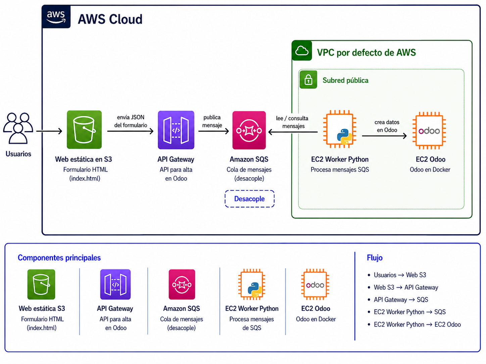

```
curl -X POST https://ci6oe0r1lb.execute-api.us-east-1.amazonaws.com/prod/pedido \
-H "Content-Type: application/json" \
-d '{"contacto": {"nombre": "Prueba"}, "producto": {"nombre": "Test", "precio_venta": 10}}'
```

```
curl -X POST https://ci6oe0r1lb.execute-api.us-east-1.amazonaws.com/prod/pedido \
-H "Content-Type: application/json" \
-d '{
  "contacto": {
    "nombre": "Prueba desde cURL",
    "email": "test-curl@sistemas.com"
  },
  "producto": {
    "nombre": "Monitor UltraWide",
    "precio_venta": 250.00,
    "coste": 190.00,
    "tipo": "consu",
    "referencia": "MON-UW-01",
    "codigo_barras": "123456789"
  }
}'
```
## Odoo
```
Instala Odoo (3 contenedores) y los módulos de ventas y contactos.
```

## El Flujo de Trabajo

    Cliente: Envía un JSON con un pedido a una URL (API Gateway).

    API Gateway: Recibe el pedido y lo mete en una cola (SQS). Responde al cliente "Recibido".

    SQS: Guarda el mensaje de forma segura.

    Tu Código Python (Worker): "Vigila" la cola. Cuando ve un mensaje, lo saca, lo procesa y crea el cliente en Odoo.

PASO 1: Configurar la "Sala de Espera" (Amazon SQS)

    Entra en la consola de AWS y busca SQS.

    Dale a Create queue.

    Selecciona Standard (es más barata y rápida).

    Nombre: PedidosOdoo.

    Deja todo lo demás por defecto y dale a Create queue.

    IMPORTANTE: Copia la URL de la cola (ej. https://sqs.us-east-1.amazonaws.com/123456/PedidosOdoo). La necesitaremos para el código.

PASO 2: Configurar la "Puerta de Entrada" (API Gateway)

Aquí crearemos la URL que recibirá los datos.

    Busca API Gateway en AWS y dale a Create API.

    Elige REST API (Build).

    Nombre: API-Odoo-Integracion.

    En el menú de la izquierda, ve a Resources -> Create Resource. Nombre: pedido.

    Selecciona /pedido y dale a Create Method. Elige POST.

    Configuración del POST:

        Integration type: AWS Service.

        AWS Region: La misma donde creaste la SQS (ej. us-east-1).

        AWS Service: Simple Queue Service (SQS).

        HTTP method: POST.

        Action Name: SendMessage.

    Mapping Templates: Dentro de la pestaña "Integration Request", ve abajo a "Mapping Templates". Añade uno de tipo application/json y pega esto:
    Action=SendMessage&MessageBody=$input.body
    (Esto le dice al API que lo que reciba por JSON lo meta tal cual en el cuerpo del mensaje de SQS).

    Dale a Deploy API, crea un Stage llamado prod y copia la Invoke URL.

PASO 3: El Código Python (El "Obrero" que conecta todo)

Este script debe estar corriendo en tu ordenador (o en una EC2). Es el puente que une AWS con Odoo.

Instala las librerías:
```
sudo dnf install pip -y
pip install boto3
```
```
aws configure
```
Crea el archivo worker_odoo.py:
Python
```
import boto3
import xmlrpc.client
import json
import time

# 1. DATOS DE TU ODOO
ODOO_URL = 'http://TU_IP_PUBLICA_EC2'
ODOO_DB = 'odoo'
ODOO_USER = 'admin'
ODOO_PASS = 'admin'

# 2. DATOS DE TU AWS SQS
QUEUE_URL = 'https://sqs.us-east-1.amazonaws.com/XXXXX/PedidosOdoo'


def ejecutar_integracion():
    sqs = boto3.client('sqs', region_name='us-east-1')

    common = xmlrpc.client.ServerProxy(f'{ODOO_URL}/xmlrpc/2/common')
    uid = common.authenticate(ODOO_DB, ODOO_USER, ODOO_PASS, {})

    if not uid:
        raise Exception("No se pudo autenticar con Odoo. Revisa DB, usuario y contraseña/API key.")

    models = xmlrpc.client.ServerProxy(f'{ODOO_URL}/xmlrpc/2/object')

    print("🚀 Worker conectado y esperando mensajes...")

    while True:
        response = sqs.receive_message(
            QueueUrl=QUEUE_URL,
            MaxNumberOfMessages=1,
            WaitTimeSeconds=10
        )

        if 'Messages' in response:
            for msg in response['Messages']:
                try:
                    print("📩 Mensaje recibido:")
                    print(msg['Body'])

                    datos = json.loads(msg['Body'])

                    contacto = datos.get('contacto', {})
                    producto = datos.get('producto', {})

                    nombre_cliente = contacto.get('nombre')
                    email_cliente = contacto.get('email')

                    nombre_producto = producto.get('nombre')
                    precio_venta = producto.get('precio_venta', 0)
                    coste = producto.get('coste', 0)
                    tipo = producto.get('tipo', 'consu')
                    referencia = producto.get('referencia')
                    codigo_barras = producto.get('codigo_barras')

                    if not nombre_cliente:
                        raise Exception("Falta contacto.nombre en el JSON")

                    if not nombre_producto:
                        raise Exception("Falta producto.nombre en el JSON")

                    print(f"📦 Procesando pedido de: {nombre_cliente}")

                    # 1. Crear cliente
                    id_cliente = models.execute_kw(
                        ODOO_DB,
                        uid,
                        ODOO_PASS,
                        'res.partner',
                        'create',
                        [{
                            'name': nombre_cliente,
                            'email': email_cliente or False,
                            'customer_rank': 1
                        }]
                    )

                    print(f"✅ Cliente creado con ID: {id_cliente}")

                    # 2. Crear producto
                    id_producto_template = models.execute_kw(
                        ODOO_DB,
                        uid,
                        ODOO_PASS,
                        'product.template',
                        'create',
                        [{
                            'name': nombre_producto,
                            'list_price': precio_venta,
                            'standard_price': coste,
                            'detailed_type': tipo,
                            'default_code': referencia or False,
                            'barcode': codigo_barras or False,
                        }]
                    )

                    print(f"✅ Producto creado con ID template: {id_producto_template}")

                    # 3. Obtener la variante real product.product
                    producto_template = models.execute_kw(
                        ODOO_DB,
                        uid,
                        ODOO_PASS,
                        'product.template',
                        'read',
                        [[id_producto_template]],
                        {'fields': ['product_variant_id']}
                    )

                    id_producto = producto_template[0]['product_variant_id'][0]

                    print(f"✅ Variante de producto ID: {id_producto}")

                    # 4. Crear pedido de venta
                    id_pedido = models.execute_kw(
                        ODOO_DB,
                        uid,
                        ODOO_PASS,
                        'sale.order',
                        'create',
                        [{
                            'partner_id': id_cliente,
                            'order_line': [(0, 0, {
                                'product_id': id_producto,
                                'product_uom_qty': 1,
                                'price_unit': precio_venta,
                            })]
                        }]
                    )

                    print(f"✅ Pedido de venta creado con ID: {id_pedido}")

                    # 5. Borrar mensaje de SQS
                    sqs.delete_message(
                        QueueUrl=QUEUE_URL,
                        ReceiptHandle=msg['ReceiptHandle']
                    )

                    print("🗑️ Mensaje eliminado de SQS")

                except Exception as e:
                    print("❌ Error procesando mensaje:")
                    print(e)
                    print("Mensaje completo:")
                    print(msg.get('Body'))

                    # De momento NO borro el mensaje si falla,
                    # para que puedas revisarlo o reintentarlo.

        time.sleep(1)


if __name__ == "__main__":
    ejecutar_integracion()
```
PASO 4: ¿Cómo lo ejecuto y lo pruebo?

Para que ver que funciona, sigue este orden:

    En la terminal: Ejecuta el script de Python:
    python worker_odoo.py
    (Verás el mensaje: "Worker conectado y esperando...")

    A. Usa el HTML en un bucket de S3. Cambia la url del api gw. Rellena el formulario y dale enviar. Mira los datos en Odoo.
    B. Desde otra terminal (o usando Postman): Vamos a simular que un cliente compra en la web enviando un pedido a la API Gateway:
    Bash
```
    curl -X POST https://tu-api-id.execute-api.us-east-1.amazonaws.com/prod/pedido \
    -H "Content-Type: application/json" \
    -d '{"nombre": "Empresa Sistemas L2", "email": "info@sistemas.com"}'
```
    Observa :

        La terminal donde corre el Python dirá instantáneamente: "Procesando pedido de: Empresa Sistemas L2".

        Entra en tu Odoo en la EC2, ve a Contactos y ¡verás que el nuevo cliente ha aparecido mágicamente sin que hayas tocado el ERP!

## API GW - Edit integration request
```
AWS Region
us-east-1
```
```
AWS service
Simple Queue Service (SQS)
```
```
HTTP method
POST
```
```
Action type
Use action name
```
```
Action name
SendMessage
```
```
Execution role
arn:aws:iam::658620698452:role/LabRole
```
```
URL request headers parameters
Name
Content-Type
Mapped from Info
'application/x-www-form-urlencoded'
Caching
```
```
Mapping templates
Content type
application/json
Generate template
Template body
Action=SendMessage&QueueUrl=https://sqs.us-east-1.amazonaws.com/658620698452/odoo&MessageBody=$util.urlEncode($input.body)
```

¿Qué tenemos ahora mismo configurado? 

    Action type: Use action name -> SendMessage

    HTTP Headers: Content-Type -> 'application/x-www-form-urlencoded'

    Mapping Template (application/json): Action=SendMessage&QueueUrl=https://sqs.us-east-1.amazonaws.com/658620698452/odoo&MessageBody=$util.urlEncode($input.body)

