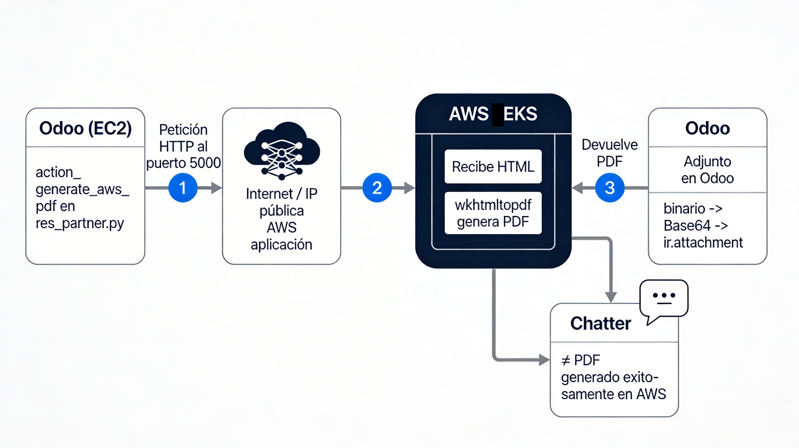

## Diagrama Odoo → AWS EKS (generación de PDF)

```
Flujo descrito en el diagrama:

    Odoo (EC2): Ejecuta la función action_generate_aws_pdf definida en el archivo res_partner.py del módulo.

    Petición: Odoo emite una petición HTTP hacia Internet buscando la IP del contenedor desplegado en AWS EKS, accediendo al puerto 5000 a través de un servicio con balanceador de carga.

    AWS EKS: El contenedor EKS recibe el HTML generado por Odoo, lo procesa con el motor interno wkhtmltopdf para “dibujar” el PDF y responde devolviendo el archivo PDF por el mismo camino.

    Resultado: Odoo recibe los datos binarios del PDF, los codifica a Base64 y crea un nuevo registro en la tabla de Adjuntos (ir.attachment).

    Feedback: En el Chatter (historial de la derecha) del registro, aparece un mensaje automático:
    ✅ PDF generado exitosamente en AWS.
```
## Ayuda

Hay que cambiar las IPs en el código odoo3.py
Coge el usuario Administrador, el primero de contactos de odoo.
```
docker build --no-cache -t api-pdf-odoo .
```
```
docker run -dp 5000:5000 api-pdf-odoo
```

## Modulo sin cargar en Odoo
```
Crear contenedor .py
Lanzar el contenedor puerto 5000
Cambiar la IP en el fichero odoo3.py de odoo y generador pdf
Mirar en usuario administrator de Odoo el PDF
```

## Modulo cargado en Odoo
```
Subir .zip a addons
Descomprimirlo
Cambiar permisos. chmod -R 755 .
Lanzar Odoo
Modo desarrollador en ajustes
Buscar módulo AWS
Ir a contactos y entrar en usuario
Levantar el contenedor en ECS o EKS por el puerto 5000
Ejecutar el boton arriba a la derecha
(Da error porque la IP del contenedor por el puerto 5000 ha cambiado, en res_partner.py cambiar la ip url_aws = "http://44.192.81.69:5000/generar-pdf")
Parar Odoo, cambiar el fichero, lanzar Odoo y probar el generador de PDF.
```
## K8s
```
kubectl apply -f .
```

