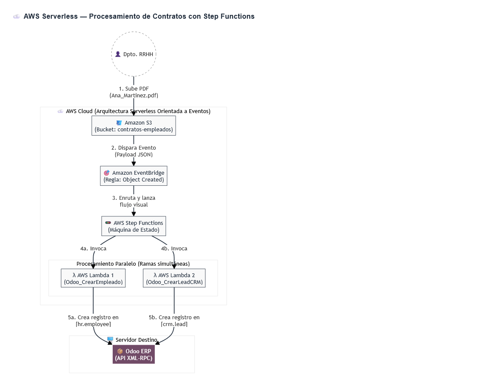

## Odoo Modules
Empleados
CRM

## Labmda Enviroment variable
```
ODOO_DB
odoo
ODOO_PASSWORD
A123456b
ODOO_URL
http://3.229.122.180:8069
ODOO_USER
s@s.com
```
## Steps
Paso 1: Crear las 2 Funciones Lambda (Los "Trabajadores")

Primero necesitamos el código que se conectará a Odoo. Como solo subimos un PDF, vamos a programar las Lambdas para que "deduzcan" el nombre del empleado leyendo el nombre del archivo (por ejemplo, si subes Juan_Perez.pdf, crearán a "Juan Perez").

1. Ve a AWS Lambda y crea la primera función:

    Nombre: Odoo_CrearEmpleado

    Runtime: Python 3.x

    Configuración: En la pestaña "Configuración > Variables de entorno", añade las credenciales de tu Odoo (ODOO_URL, ODOO_DB, ODOO_USER, ODOO_PASSWORD).

    Código Python:
    Python

    import os
    import urllib.parse
    import xmlrpc.client

    def lambda_handler(event, context):
        # 1. EventBridge + Step Functions nos enviarán los detalles del archivo
        key = urllib.parse.unquote_plus(event['detail']['object']['key'])

        # 2. Limpiamos el nombre del archivo para sacar el nombre del empleado
        nombre_empleado = key.replace('_', ' ').replace('.pdf', '')

        # 3. Conexión a Odoo
        url = os.environ.get('ODOO_URL')
        db = os.environ.get('ODOO_DB')
        user = os.environ.get('ODOO_USER')
        password = os.environ.get('ODOO_PASSWORD')

        common = xmlrpc.client.ServerProxy(f'{url}/xmlrpc/2/common')
        uid = common.authenticate(db, user, password, {})
        models = xmlrpc.client.ServerProxy(f'{url}/xmlrpc/2/object')

        # 4. Crear en el módulo de Empleados (hr.employee)
        empleado_id = models.execute_kw(db, uid, password, 'hr.employee', 'create', [{
            'name': nombre_empleado,
            'job_title': 'Nuevo Ingreso'
        }])

        return {"mensaje": f"Empleado {nombre_empleado} creado con ID {empleado_id}"}

2. Crea la segunda función Lambda:

    Nombre: Odoo_CrearLeadCRM

    Runtime y Variables: Igual que la anterior.

    Código Python:
    Python

    import os
    import urllib.parse
    import xmlrpc.client

    def lambda_handler(event, context):
        key = urllib.parse.unquote_plus(event['detail']['object']['key'])
        nombre_empleado = key.replace('_', ' ').replace('.pdf', '')

        url = os.environ.get('ODOO_URL')
        db = os.environ.get('ODOO_DB')
        user = os.environ.get('ODOO_USER')
        password = os.environ.get('ODOO_PASSWORD')

        common = xmlrpc.client.ServerProxy(f'{url}/xmlrpc/2/common')
        uid = common.authenticate(db, user, password, {})
        models = xmlrpc.client.ServerProxy(f'{url}/xmlrpc/2/object')

        # Crear en el módulo de CRM (crm.lead) para asignarle su primer equipo/ordenador
        lead_id = models.execute_kw(db, uid, password, 'crm.lead', 'create', [{
            'name': f'Preparar equipo informático para {nombre_empleado}',
            'description': 'Lanzado automáticamente al firmar contrato.'
        }])

        return {"mensaje": f"Lead creado con ID {lead_id}"}

(Copia los ARN de ambas Lambdas, los necesitarás en el siguiente paso).
Paso 2: Configurar Step Functions (El "Orquestador")

Aquí es donde creamos el flujo visual que dice "ejecuta estas dos cosas a la vez".

    Ve al servicio AWS Step Functions.

    Haz clic en Crear máquina de estado (Create state machine).

    Elige Escribir tu propio código (Write your workflow in code).

    Pega el siguiente código JSON. Importante: Reemplaza los ARN_DE_TU_LAMBDA_... por los ARNs reales que copiaste en el paso anterior.
    JSON

    {
      "Comment": "Flujo paralelo de Onboarding para Odoo",
      "StartAt": "Procesamiento Paralelo",
      "States": {
        "Procesamiento Paralelo": {
          "Type": "Parallel",
          "End": true,
          "Branches": [
            {
              "StartAt": "Crear Empleado",
              "States": {
                "Crear Empleado": {
                  "Type": "Task",
                  "Resource": "arn:aws:lambda:REGION:CUENTA:function:Odoo_CrearEmpleado",
                  "End": true
                }
              }
            },
            {
              "StartAt": "Crear Lead Informática",
              "States": {
                "Crear Lead Informática": {
                  "Type": "Task",
                  "Resource": "arn:aws:lambda:REGION:CUENTA:function:Odoo_CrearLeadCRM",
                  "End": true
                }
              }
            }
          ]
        }
      }
    }

    Guarda la máquina de estado con el nombre FlujoOnboardingOdoo. Copia el ARN de esta máquina de estado.

Paso 3: Crear el Bucket S3 (El "Gatillo")

    Ve a Amazon S3 y crea un bucket (ej. contratos-empleados-odoo).

    ¡Paso crítico! Una vez creado, entra al bucket, ve a la pestaña Propiedades (Properties).

    Baja hasta la sección Amazon EventBridge y haz clic en Editar.

    Activa la opción Enviar notificaciones a Amazon EventBridge y guarda. (Si no haces esto, S3 no avisará de que ha llegado un archivo nuevo).

Paso 4: Configurar EventBridge (El "Router")

Por último, necesitamos el "cable" que conecte S3 con Step Functions.

    Ve al servicio Amazon EventBridge.

    En el menú lateral, selecciona Reglas (Rules) y dale a Crear regla.

    Nombre: CapturarContratoS3. Tipo de regla: Regla con un patrón de eventos.

    En la sección Patrón de creación, elige Patrón personalizado (JSON) y pega esto (cambiando el nombre de tu bucket):
    JSON

    {
      "source": ["aws.s3"],
      "detail-type": ["Object Created"],
      "detail": {
        "bucket": {
          "name": ["contratos-empleados-odoo"]
        }
      }
    }

    Dale a Siguiente. En la pantalla de Destinos (Targets), elige:

        Tipo de destino: Servicio de AWS

        Destino: Máquina de estado de Step Functions

        Máquina de estado: Selecciona la que creaste en el Paso 2 (FlujoOnboardingOdoo).

        Tipo de ejecución: Estándar.

    Termina y crea la regla.


Tu arquitectura está lista. Para enseñárselo a los alumnos en clase, el efecto "Wow" se hace así:

    Abre tres pestañas: tu módulo de Empleados en Odoo, tu módulo de CRM en Odoo y el flujo visual de tu Step Function en AWS.

    Sube un archivo llamado Ana_Martinez.pdf a tu bucket de S3.

    Inmediatamente, la ejecución en Step Functions se iluminará en verde mostrando cómo las dos ramas paralelas se completan.

    Refresca Odoo: ¡Tendrás a "Ana Martinez" creada como empleada y un nuevo Lead en el CRM pidiendo su ordenador portátil!
