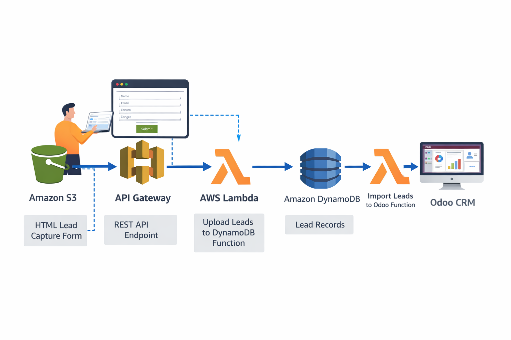

## Steps
Paso 1: Crear la tabla en DynamoDB (El almacén ultra-rápido)

    Ve a la consola de AWS > DynamoDB > Crear tabla.

    Nombre de la tabla: LeadsFeria

    Clave de partición: lead_id (Tipo: Cadena / String).

    Deja los ajustes predeterminados y créala.

    🚨 ¡Paso Crítico! Una vez creada, entra en la tabla, ve a la pestaña Exportaciones y secuencias (Exports and streams) y Activa DynamoDB Streams.

        Elige Imagen nueva (New image). Esto hará que cada vez que entre un Lead, DynamoDB lance una alerta con los datos nuevos.

Paso 2: Lambda 1 (Guardar en DynamoDB)

Esta Lambda será llamada por el API Gateway, recogerá el JSON de la web y lo meterá en DynamoDB.

    Ve a Lambda > Crear función. Llámala ApiIngestLead (Python 3.12).

    En Permisos, asegúrate de que el Rol de ejecución tenga una política que permita escribir en DynamoDB (AmazonDynamoDBFullAccess o una política custom con dynamodb:PutItem).

    Pega este código:

Python
```
import json
import boto3
import uuid
from datetime import datetime

dynamodb = boto3.resource('dynamodb')
table = dynamodb.Table('LeadsFeria')

def lambda_handler(event, context):
    try:
        # El API Gateway envía el body como string, hay que parsearlo
        body = json.loads(event.get('body', '{}'))
        
        lead_id = str(uuid.uuid4()) # Generar ID único
        
        # Estructura del item a guardar
        item = {
            'lead_id': lead_id,
            'nombre': body.get('nombre', 'Sin Nombre'),
            'email': body.get('email', 'Sin Email'),
            'empresa': body.get('empresa', ''),
            'timestamp': datetime.utcnow().isoformat()
        }
        
        # Guardar en DynamoDB
        table.put_item(Item=item)
        
        # Respuesta obligatoria con CORS para que el navegador no bloquee la petición
        return {
            'statusCode': 200,
            'headers': {
                'Access-Control-Allow-Origin': '*',
                'Access-Control-Allow-Headers': 'Content-Type',
                'Access-Control-Allow-Methods': 'OPTIONS,POST'
            },
            'body': json.dumps({'mensaje': 'Lead guardado con éxito', 'id': lead_id})
        }
        
    except Exception as e:
        return {
            'statusCode': 500,
            'headers': {'Access-Control-Allow-Origin': '*'},
            'body': json.dumps({'error': str(e)})
        }
```
Guarda y haz Deploy.
Paso 3: API Gateway (La puerta de entrada)

    Ve a API Gateway > Crear API > API REST (Construir).

    Nombre: LeadsAPI.

    Crea un recurso: Acciones > Crear Recurso > Nombre: lead.

    Crea un método: Selecciona el recurso /lead > Acciones > Crear Método > POST.

        Integración: Función Lambda.

        Selecciona tu función ApiIngestLead.

    🚨 Habilitar CORS: Selecciona el recurso /lead > Acciones > Habilitar CORS (Enable CORS). Deja todo por defecto y acepta.

    Desplegar API: Acciones > Implementar API (Deploy API). Crea una etapa nueva llamada prod.

    Copia la URL de invocación (Terminará en /prod/lead).

Paso 4: La Web Estática (HTML + JS para Amazon S3)

Crea este archivo index.html. Reemplaza la URL de la constante API_URL por la que acabas de copiar de API Gateway. Luego sube este archivo a un bucket S3 configurado como "Alojamiento de sitios web estáticos".
HTML
```
<!DOCTYPE html>
<html lang="es">
<head>
    <meta charset="UTF-8">
    <meta name="viewport" content="width=device-width, initial-scale=1.0">
    <title>Captación de Leads - Feria</title>
    <style>
        body { font-family: Arial, sans-serif; background-color: #f4f4f9; display: flex; justify-content: center; align-items: center; height: 100vh; margin: 0; }
        .card { background: white; padding: 30px; border-radius: 10px; box-shadow: 0 4px 8px rgba(0,0,0,0.1); width: 100%; max-width: 400px; }
        input, button { width: 100%; padding: 10px; margin: 10px 0; border-radius: 5px; border: 1px solid #ccc; box-sizing: border-box; }
        button { background-color: #714B67; color: white; border: none; cursor: pointer; font-weight: bold; }
        button:hover { background-color: #5a3952; }
        #mensaje { text-align: center; font-weight: bold; margin-top: 10px; }
    </style>
</head>
<body>

<div class="card">
    <h2 style="text-align: center; color: #714B67;">Nuevo Lead (Offline/Online)</h2>
    <form id="leadForm">
        <input type="text" id="nombre" placeholder="Nombre completo" required>
        <input type="email" id="email" placeholder="Correo electrónico" required>
        <input type="text" id="empresa" placeholder="Empresa" required>
        <button type="submit">Guardar Lead</button>
    </form>
    <div id="mensaje"></div>
</div>

<script>
    // REEMPLAZA ESTA URL CON LA TUYA DE API GATEWAY
    const API_URL = "https://tu-api-id.execute-api.us-east-1.amazonaws.com/prod/lead";

    document.getElementById("leadForm").addEventListener("submit", async (e) => {
        e.preventDefault(); // Evita que la página recargue
        
        const data = {
            nombre: document.getElementById("nombre").value,
            email: document.getElementById("email").value,
            empresa: document.getElementById("empresa").value
        };

        const btn = document.querySelector("button");
        const msg = document.getElementById("mensaje");
        btn.disabled = true; btn.innerText = "Guardando...";

        try {
            const response = await fetch(API_URL, {
                method: "POST",
                headers: { "Content-Type": "application/json" },
                body: JSON.stringify(data)
            });

            if(response.ok) {
                msg.style.color = "green";
                msg.innerText = "¡Lead guardado correctamente!";
                document.getElementById("leadForm").reset();
            } else {
                throw new Error("Error en el servidor");
            }
        } catch (error) {
            msg.style.color = "red";
            msg.innerText = "Error de conexión. Inténtalo de nuevo.";
        } finally {
            btn.disabled = false; btn.innerText = "Guardar Lead";
        }
    });
</script>

</body>
</html>
```
Paso 5: Lambda 2 (Sincronizar a Odoo por Eventos)

Esta Lambda se despertará automáticamente cuando el Lead caiga en DynamoDB, e inyectará los datos en el CRM de Odoo usando su API oficial (XML-RPC).

    Ve a Lambda > Crear función. Llámala SyncLeadToOdoo (Python 3.12).

    En Permisos, el rol necesita permisos para leer el Stream de DynamoDB (AWSLambdaDynamoDBExecutionRole).

    En la vista general de la Lambda, dale a Añadir Desencadenador (Add trigger). Selecciona DynamoDB, elige la tabla LeadsFeria, y pon tamaño de lote (Batch size) en 1.

    Pega este código:

Python
```
import xmlrpc.client
import os

# Credenciales de tu Odoo (Idealmente deberían ir en Variables de Entorno de la Lambda)
ODOO_URL = os.environ.get('ODOO_URL', 'http://TU_IP_DE_EC2:8069')
ODOO_DB = os.environ.get('ODOO_DB', 'odoo_produccion')
ODOO_USER = os.environ.get('ODOO_USER', 'tu_email_admin@empresa.com')
ODOO_PASSWORD = os.environ.get('ODOO_PASSWORD', 'tu_contraseña')

def lambda_handler(event, context):
    try:
        # 1. Autenticación con Odoo
        common = xmlrpc.client.ServerProxy('{}/xmlrpc/2/common'.format(ODOO_URL))
        uid = common.authenticate(ODOO_DB, ODOO_USER, ODOO_PASSWORD, {})
        
        if not uid:
            print("Error: No se pudo autenticar en Odoo")
            return
            
        models = xmlrpc.client.ServerProxy('{}/xmlrpc/2/object'.format(ODOO_URL))

        # 2. Procesar los registros que vienen de DynamoDB Streams
        for record in event['Records']:
            # Solo nos interesan los registros nuevos (INSERT)
            if record['eventName'] == 'INSERT':
                # Extraer los datos (DynamoDB Streams usa un formato JSON con tipos de datos como 'S' para String)
                new_image = record['dynamodb']['NewImage']
                
                nombre = new_image.get('nombre', {}).get('S', 'Sin nombre')
                email = new_image.get('email', {}).get('S', '')
                empresa = new_image.get('empresa', {}).get('S', '')
                
                # 3. Inyectar en el módulo CRM de Odoo (Modelo: crm.lead)
                lead_id = models.execute_kw(ODOO_DB, uid, ODOO_PASSWORD,
                    'crm.lead', 'create', [{
                        'name': f'Lead Feria: {nombre}', # Título de la oportunidad
                        'contact_name': nombre,
                        'email_from': email,
                        'partner_name': empresa,
                        'description': 'Lead capturado vía Serverless / S3'
                    }])
                
                print(f"Éxito: Lead {nombre} creado en Odoo con ID {lead_id}")
                
        return "Sincronización completada"
        
    except Exception as e:
        print(f"Error crítico en la sincronización: {str(e)}")
        # Al lanzar el error, DynamoDB retendrá el evento y lo reintentará más tarde
        raise e
```
