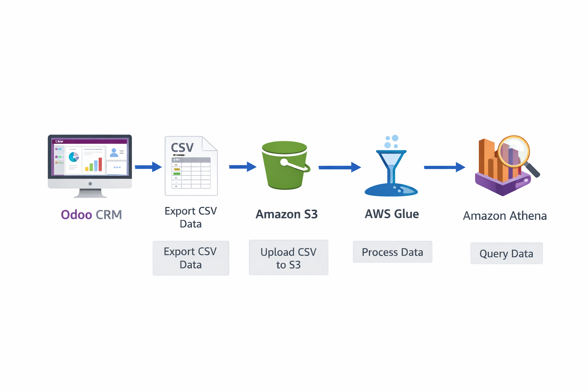

## CSV

¿Qué aspecto tiene el CSV?

```
order_id,date_order,customer_name,country,product_category,product_name,quantity,unit_price,total_amount,status
SO0842,2025-01-01 00:00:00,Comercial Sur,Chile,Hardware,Servidor Dell PowerEdge,14,1382.45,19354.3,Sale
SO0311,2025-01-02 00:00:00,Tech Solutions,España,Servicios Cloud,Migración de Servidores,3,845.2,2535.6,Sale
SO0991,2025-01-02 00:00:00,Industrias XYZ,México,Consultoría,Diseño de Arquitectura,8,150.75,1206.0,Cancelled
SO0105,2025-01-04 00:00:00,Empresa Alfa,Perú,Licencias Software,Odoo Enterprise (50 Users),1,950.0,950.0,Sale
SO0450,2025-01-05 00:00:00,Consultoría Global,Colombia,Soporte Técnico,Bolsa de 50h,2,600.0,1200.0,Draft
... (hasta 1000 registros)
```

## Glue - Athena
Al tener columnas como country y product_category, cuando AWS Glue lo rastree (con un Crawler), creará automáticamente una tabla en el Data Catalog. Luego, con Amazon Athena, tus alumnos podrán lanzar consultas SQL reales como SELECT country, SUM(total_amount) FROM ventas_odoo GROUP BY country; sin necesidad de tener un motor de base de datos encendido.
