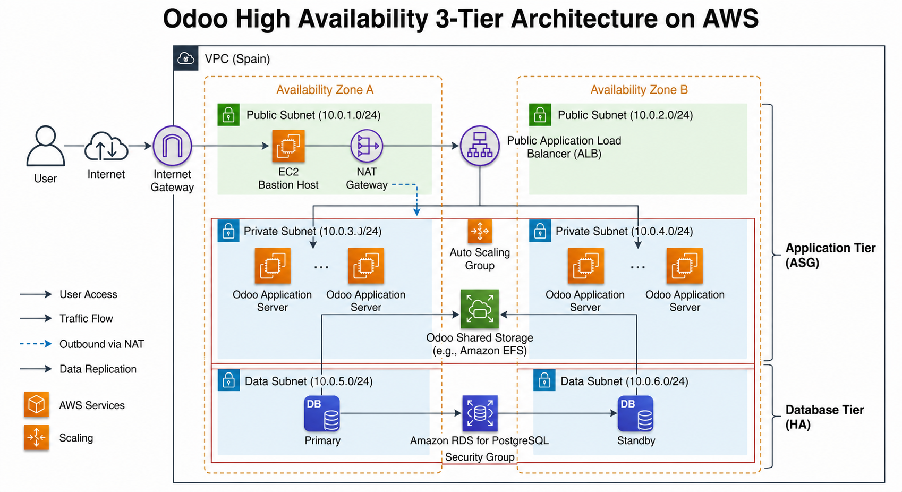

## Create VPC Odoo
```
CIDR: 10.40.0.0/16
6 Subnets: 10.40.x.0/24
1 NAT GW
```
## Create 4 SG
```
SGec2: 22 y 80
SGalb: 80
SGefs: 2049
SGPostgres: 5432
```
## Create RDS Postgress (Get EndPoint)
```
User: odoo
Password A123456b
BBDD: odoo
```
## Create EFS 
```

```
## Parameter -Store
```
Abre Systems Manager.
En el menú lateral, entra en Parameter Store.
Pulsa Create parameter.
Crea estos 3 parámetros, uno por uno. AWS permite nombres jerárquicos como /odoo/prod/db_user.
```
```
Parámetro 1
Name: /odoo/prod/db_user
Description: Usuario de PostgreSQL para Odoo
Tier: Standard
Type: SecureString
Value: odoo
```
```
Parámetro 2
Name: /odoo/prod/db_password
Description: Password de PostgreSQL para Odoo
Tier: Standard
Type: SecureString
Value: A123456b
```
```
Parámetro 3
Name: /odoo/prod/admin_passwd
Description: Master password de Odoo
Tier: Standard
Type: SecureString
Value: A123456b
```
## User-Data  --- IAM Role = LabInstaceProfile
```
 Cambia el FS ID y el Endpoint BBDD)
```
```
#!/bin/bash
set -euo pipefail

AWS_REGION="us-east-1"

EFS_DNS="fs-0eae71a7a68c14d52.efs.us-east-1.amazonaws.com"
EFS_MOUNT="/mnt/odoo-data"
APP_DIR="/home/ec2-user/odoo-pilot"

DB_HOST="odoo.cwaesfdjquns.us-east-1.rds.amazonaws.com"
DB_PORT="5432"
DB_NAME="odoo"

SSM_DB_USER="/odoo/prod/db_user"
SSM_DB_PASSWORD="/odoo/prod/db_password"
SSM_ADMIN_PASSWD="/odoo/prod/admin_passwd"

ODOO_IMAGE="odoo:19.0"

# 1. Sistema base
dnf update -y
dnf install -y docker amazon-efs-utils
systemctl enable --now docker
usermod -aG docker ec2-user

# 2. Docker Compose V2
mkdir -p /usr/local/lib/docker/cli-plugins/
if [ ! -x /usr/local/lib/docker/cli-plugins/docker-compose ]; then
  curl -SL https://github.com/docker/compose/releases/latest/download/docker-compose-linux-x86_64 \
    -o /usr/local/lib/docker/cli-plugins/docker-compose
  chmod +x /usr/local/lib/docker/cli-plugins/docker-compose
fi

# 3. Montaje EFS
mkdir -p "${EFS_MOUNT}"

if ! mountpoint -q "${EFS_MOUNT}"; then
  mount -t nfs4 -o nfsvers=4.1,rsize=1048576,wsize=1048576,hard,timeo=600,retrans=2,noresvport \
    "${EFS_DNS}:/" "${EFS_MOUNT}"
fi

grep -q "^${EFS_DNS}:/ ${EFS_MOUNT} " /etc/fstab || \
echo "${EFS_DNS}:/ ${EFS_MOUNT} nfs4 nfsvers=4.1,rsize=1048576,wsize=1048576,hard,timeo=600,retrans=2,noresvport,_netdev 0 0" >> /etc/fstab

# 4. Permisos para Odoo
chown -R 101:101 "${EFS_MOUNT}"
chmod -R 775 "${EFS_MOUNT}"

# 5. Leer secretos desde Parameter Store
DB_USER="$(aws ssm get-parameter \
  --region "${AWS_REGION}" \
  --name "${SSM_DB_USER}" \
  --with-decryption \
  --query 'Parameter.Value' \
  --output text)"

DB_PASSWORD="$(aws ssm get-parameter \
  --region "${AWS_REGION}" \
  --name "${SSM_DB_PASSWORD}" \
  --with-decryption \
  --query 'Parameter.Value' \
  --output text)"

ADMIN_PASSWD="$(aws ssm get-parameter \
  --region "${AWS_REGION}" \
  --name "${SSM_ADMIN_PASSWD}" \
  --with-decryption \
  --query 'Parameter.Value' \
  --output text)"

# 6. Directorio de trabajo
mkdir -p "${APP_DIR}"
cd "${APP_DIR}"

# 7. Configuración de Odoo
cat > odoo.conf <<EOF
[options]
admin_passwd = ${ADMIN_PASSWD}
db_host = ${DB_HOST}
db_user = ${DB_USER}
db_password = ${DB_PASSWORD}
db_port = ${DB_PORT}
db_name = ${DB_NAME}
http_port = 8069
http_interface = 0.0.0.0
proxy_mode = True
list_db = False
data_dir = /var/lib/odoo
EOF

chmod 644 odoo.conf

# 8. Docker Compose
cat > docker-compose.yml <<EOF
services:
  odoo:
    image: ${ODOO_IMAGE}
    container_name: odoo_piloto
    ports:
      - "80:8069"
    volumes:
      - ${EFS_MOUNT}:/var/lib/odoo
      - ./odoo.conf:/etc/odoo/odoo.conf:ro
    restart: always
EOF

# 9. Arrancar Odoo
docker compose pull
docker compose up -d

# 10. Permisos finales
chown -R ec2-user:ec2-user "${APP_DIR}"
```
## Reiniciar Odoo BBDD la primera vez desde el BH
```
docker exec -i odoo_piloto odoo -c /etc/odoo/odoo.conf -d odoo -i base --without-demo=all --stop-after-init
```
## Crear AMI del BH.
```

```
## Crear Lauch Template (LT= con AMI
```

```
## Crear ASG con LT
```

```
## Login
```
user/email: admin
password: admin
```
## ALB con ASG
```
proxy_mode = True
```
## TG en ALB
```
Pon el health check así:
Protocol: HTTP
Port: traffic port
Path: /web/login
Success codes: 200-399
No uses / si a veces te redirige raro o da 500 durante el arranque.
```

## Borrar ficheros en caso de que no se vea bien la web
```
docker exec -i odoo_piloto odoo shell -c /etc/odoo/odoo.conf -d odoo <<'PY'
env.cr.execute("DELETE FROM ir_attachment WHERE url LIKE '/web/assets/%'")
env.cr.commit()
print("Assets web eliminados")
PY

docker exec -i odoo_piloto odoo -c /etc/odoo/odoo.conf -d odoo -u web --stop-after-init
docker restart odoo_piloto
```


```
--------------------------------
--------------------------------
--------------------------------
--------------------------------
--------------------------------
```

## Version antigua - NO USAR
## Create EFS 

## user-data
```
#!/bin/bash
# 1. Actualizar e instalar Docker y utilidades de EFS
dnf update -y
dnf install -y docker amazon-efs-utils
systemctl enable --now docker
usermod -aG docker ec2-user

# 2. Instalar Docker Compose V2
mkdir -p /usr/local/lib/docker/cli-plugins/
curl -SL https://github.com/docker/compose/releases/latest/download/docker-compose-linux-x86_64 -o /usr/local/lib/docker/cli-plugins/docker-compose
chmod +x /usr/local/lib/docker/cli-plugins/docker-compose

# 3. Configurar el montaje de EFS (REEMPLAZA fs-XXXXXX con tu ID)
mkdir -p /mnt/odoo-data
# Montamos el EFS
sudo mount -t nfs4 -o nfsvers=4.1,rsize=1048576,wsize=1048576,hard,timeo=600,retrans=2,noresvport fs-04bb2995d5c63aab7.efs.us-east-1.amazonaws.com:/ /mnt/odoo-data
# Aseguramos que se monte en cada reinicio
echo "fs-04bb2995d5c63aab7.efs.us-east-1.amazonaws.com:/ /mnt/odoo-data efs _netdev,tls 0 0" >> /etc/fstab

# 4. PASO CLAVE: Permisos para el contenedor (UID 101 es el usuario 'odoo')
chown -R 101:101 /mnt/odoo-data
chmod -R 775 /mnt/odoo-data

# 5. Preparar directorio de trabajo
mkdir -p /home/ec2-user/odoo-pilot
cd /home/ec2-user/odoo-pilot

# 6. Crear el archivo odoo.conf (Añadimos proxy_mode para el balanceador)
cat <<EOF > odoo.conf
[options]
admin_passwd = admin_master_pilot
db_host = odoo.cfiy5oksqwsu.us-east-1.rds.amazonaws.com
db_user = odoo
db_password = A123456b
db_port = 5432
http_port = 8069
proxy_mode = True
EOF

# 7. Crear el archivo docker-compose.yml usando el EFS
cat <<EOF > docker-compose.yml
services:
  odoo:
    image: odoo:latest
    container_name: odoo_piloto
    ports:
      - "80:8069"
    volumes:
      - /mnt/odoo-data:/var/lib/odoo
      - ./odoo.conf:/etc/odoo/odoo.conf
    environment:
      - HOST=odoo.cfiy5oksqwsu.us-east-1.rds.amazonaws.com
      - USER=odoo
      - PASSWORD=A123456b
    restart: always
EOF

# 8. Lanzar Odoo
docker compose up -d

# 9. Permisos finales para la carpeta del proyecto
chown -R ec2-user:ec2-user /home/ec2-user/odoo-pilot
```

```
