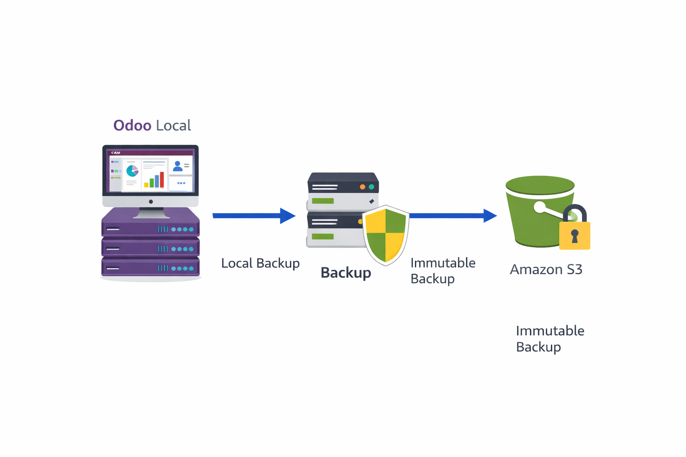

## Steps
Fase 1: S3 con Object Lock

Vamos a crear una bóveda en la que los archivos entran, pero nadie los puede borrar ni modificar durante un tiempo determinado.

    Ve a Amazon S3 > Crear bucket.

    Llámalo odoo-boveda-ransomware-tuapellido.

    🚨 Paso Crítico 1: Habilita el Control de versiones de buckets (Versioning). Es obligatorio para la inmutabilidad.

    🚨 Paso Crítico 2: Baja hasta la sección Bloqueo de objetos (Object Lock) y actívalo. Marca la casilla de confirmación.

    Crea el bucket.

    Entra al bucket > Pestaña Propiedades > Baja hasta Bloqueo de objetos y dale a Editar.

        Activa el modo de retención predeterminado.

        Selecciona Conformidad (Compliance). (Nota: En modo Compliance, ni siquiera el usuario Root de la cuenta de AWS puede borrar el archivo. En modo Gobernanza, un admin sí puede. Usa Conformidad para máxima seguridad).

        Pon un periodo de retención: 7 días.

Fase 2: El Script Híbrido (En el servidor "On-Premise")

Asumiendo que tus alumnos están en una máquina virtual de VirtualBox, un servidor de la escuela o una EC2 que simula la oficina:

    Configura las credenciales del "Mensajero Ciego":
    Bash

    aws configure

    (Pega el Access Key y Secret Key. Pon la región de tu bucket, ej. us-east-1, y formato json).

    Crea el script de backup:
    Bash
```
    nano backup_hibrido.sh
```

    Pega este código. Hace un volcado de la base de datos, lo comprime y lo sube a la bóveda inmutable:
    Bash
```
    #!/bin/bash

    # Configuración
    FECHA=$(date +%Y-%m-%d_%H-%M)
    ARCHIVO_DB="/tmp/odoo_db_$FECHA.sql"
    ARCHIVO_ZIP="/tmp/odoo_backup_full_$FECHA.tar.gz"
    BUCKET="s3://odoo-boveda-ransomware-tuapellido"

    echo "Iniciando backup local de Odoo..."

    # 1. Volcado de la base de datos (PostgreSQL)
    # (Ajusta el usuario y contraseña según tu instalación local)
    PGPASSWORD=tu_contraseña_local pg_dump -U odoo -h localhost -F c -d odoo > $ARCHIVO_DB

    # 2. Comprimir la BD (y podrías añadir la carpeta de filestore aquí)
    tar -czf $ARCHIVO_ZIP $ARCHIVO_DB

    echo "Subiendo a AWS S3 (Bóveda Inmutable)..."

    # 3. Enviar a AWS (El corazón de la arquitectura híbrida)
    aws s3 cp $ARCHIVO_ZIP $BUCKET/

    # 4. Limpieza local para no llenar el disco físico
    rm $ARCHIVO_DB $ARCHIVO_ZIP

    echo "¡Backup finalizado y asegurado en la nube!"
```
    Dale permisos de ejecución:
    Bash
```
    chmod +x backup_hibrido.sh
```
Fase 4: La Prueba de Fuego (Demostración a los alumnos)

    Que ejecuten el script: ./backup_hibrido.sh

    Que ve a la consola de AWS y ver que el archivo .tar.gz ha llegado al bucket.

    El momento "Hackerman": Píde que intente borrar ese archivo usando la consola web de AWS o el CLI.

¿Qué pasará?
AWS les lanzará un error rojo gigante: Access Denied o Object under active Compliance Retention.

"Acabáis de diseñar una arquitectura que ni siquiera vosotros mismos podéis destruir. Si un Ransomware encripta la oficina entera mañana, la empresa no tiene que pagar el rescate; reinstalamos el servidor, bajamos el backup de hace una hora desde AWS S3, y seguimos operando".
