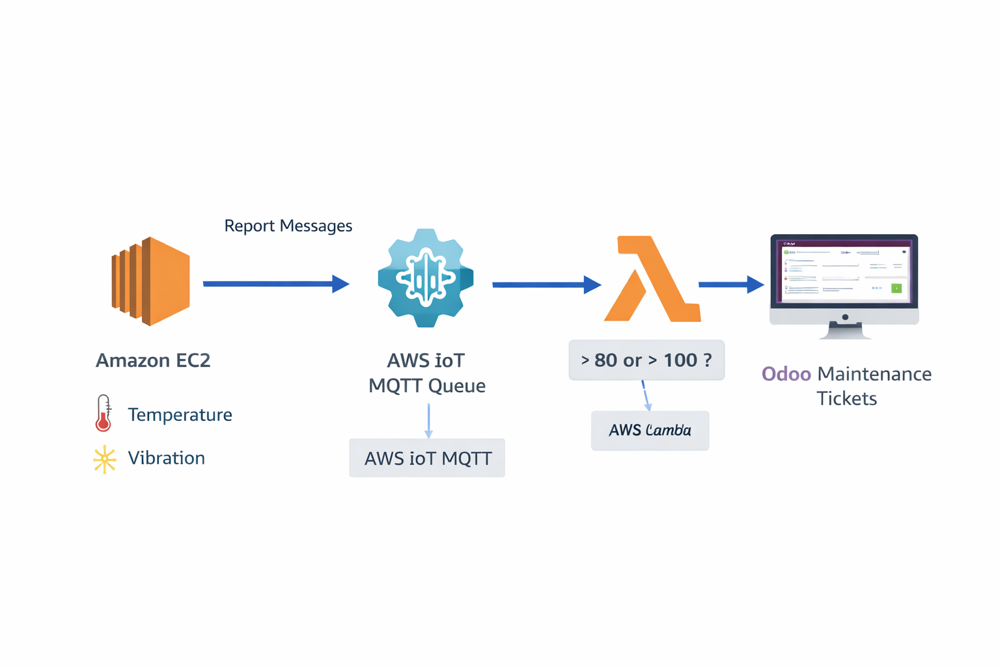

## Steps
Industria 4.0.

Integrar hardware físico (o simulado, en nuestro caso) con un ERP no es trivial. El reto del IoT es que las máquinas generan miles de mensajes por minuto. Si enviaras eso directamente a Odoo, el servidor explotaría en segundos.

Al poner AWS IoT Core en medio, creas un "embudo inteligente". IoT Core se traga los miles de mensajes por segundo sin inmutarse, y la Regla IoT actúa como un filtro que solo despierta a la Lambda (y a Odoo) cuando los parámetros indican que la máquina va a romperse.

Aquí tienes la "Receta Maestra" paso a paso para montar este sistema de Mantenimiento Predictivo.
Fase 1: Preparación en Odoo

Para que la Lambda pueda crear una orden de revisión, Odoo debe estar listo.

    Entra a tu Odoo y ve al menú de Aplicaciones (Apps).

    Instala la aplicación Mantenimiento (Maintenance).
    (Esta app tiene un modelo interno llamado maintenance.request que es el que atacaremos por API).

Fase 2: AWS IoT Core (El Hub de las Máquinas)

Tenemos que registrar nuestra "máquina virtual" en AWS y darle sus credenciales criptográficas. El protocolo MQTT en AWS exige seguridad TLS mutua.

    Ve a la consola de AWS y abre IoT Core.

    Crear el Objeto (Thing): En el menú izquierdo, ve a Administrar > Todos los dispositivos > Objetos (Things). Dale a Crear objeto > Crear un solo objeto. Ponle de nombre Maquina-01 y dale a Siguiente.

    Certificados (¡Crítico!): Selecciona Generar un nuevo certificado de forma automática (recomendado).

    En la pantalla final, DESCARGA LOS 4 ARCHIVOS (Certificado del dispositivo, Clave pública, Clave privada y el certificado raíz Amazon Root CA 1). Guárdalos en una carpeta en tu ordenador llamada sensor_iot. Una vez descargados, dale a Activar y a Listo.

    Crear la Política de Seguridad: En el menú izquierdo ve a Seguridad > Políticas. Crea una nueva llamada PermisoTotalIoT. En el constructor visual, pon Efecto: Allow, Acción: iot:*, Recurso: *. (En producción se restringe más, pero para la clase esto evita dolores de cabeza).

    Asociar la Política: Vuelve a Seguridad > Certificados, selecciona el certificado que acabas de crear, dale a Acciones > Asociar política, y selecciona PermisoTotalIoT.

    Obtener tu Endpoint: En el menú inferior izquierdo de IoT Core, ve a Configuración (Settings). Copia el Punto de enlace del dispositivo (Endpoint). Tiene formato xxxxxx-ats.iot.us-east-1.amazonaws.com.

Fase 3: La Lambda (El Mecánico Virtual)

Esta Lambda será despertada solo cuando haya peligro, e inyectará el ticket en Odoo.

    Ve a Lambda > Crear función. Llámala OdooMaintenanceTrigger (Python 3.12).

    Pega este código exacto:

Python
```
import xmlrpc.client
import os

# Variables de entorno (Configúralas en la pestaña Configuración de la Lambda)
ODOO_URL = os.environ.get('ODOO_URL', 'http://TU_IP_DE_ODOO:8069')
ODOO_DB = os.environ.get('ODOO_DB', 'odoo_produccion')
ODOO_USER = os.environ.get('ODOO_USER', 'tu_email@admin.com')
ODOO_PASSWORD = os.environ.get('ODOO_PASSWORD', 'tu_contraseña')

def lambda_handler(event, context):
    # La regla IoT nos pasará el JSON del sensor directamente en el 'event'
    maquina = event.get('maquina_id', 'Máquina Desconocida')
    temp = event.get('temperatura', 0)
    vib = event.get('vibracion', 0)

    print(f"🔥 ALERTA RECIBIDA: {maquina} | Temp: {temp}°C | Vibración: {vib}")

    try:
        # 1. Autenticación con Odoo
        common = xmlrpc.client.ServerProxy(f'{ODOO_URL}/xmlrpc/2/common')
        uid = common.authenticate(ODOO_DB, ODOO_USER, ODOO_PASSWORD, {})

        if not uid:
            print("Error de autenticación en Odoo")
            return {"status": "error", "message": "Fallo auth Odoo"}

        models = xmlrpc.client.ServerProxy(f'{ODOO_URL}/xmlrpc/2/object')

        # 2. Crear ticket en el módulo Mantenimiento (modelo 'maintenance.request')
        ticket_id = models.execute_kw(ODOO_DB, uid, ODOO_PASSWORD,
            'maintenance.request', 'create', [{
                'name': f'🚨 ALERTA IOT: {maquina} sobrecalentada',
                'description': f'Alerta automática generada por AWS IoT Core.\n\nValores registrados:\n- Temperatura: {temp}°C\n- Vibración: {vib} Hz\n\n¡Requiere revisión inmediata para evitar parada de línea!',
                'priority': '3', # Estrella 3 en Odoo (Alta prioridad)
            }])

        print(f"✅ Ticket de mantenimiento creado con éxito. ID: {ticket_id}")
        return {"status": "success", "ticket_id": ticket_id}

    except Exception as e:
        print(f"❌ Error conectando a Odoo: {str(e)}")
        raise e
```
(No olvides configurar las variables de entorno ODOO_URL, etc., en la configuración de la Lambda).
Fase 4: La Regla IoT (El Cerebro)

Vamos a decirle a AWS IoT que escuche a la máquina, pero que solo ejecute la Lambda si la máquina "grita" de dolor.

    En IoT Core, ve al menú izquierdo: Enrutamiento de mensajes > Reglas.

    Dale a Crear regla. Llámala AlertaSobrecalentamiento.

    Instrucción SQL: Aquí viene la magia. Pega esto:
    SQL

    SELECT * FROM 'fabrica/+/telemetria' WHERE temperatura > 80 OR vibracion > 100

    (Esto significa: Escucha el topic fabrica/.../telemetria. Si la temperatura supera 80 o la vibración 100, captura el JSON entero).

    Acciones de la regla: Dale a Añadir acción > Busca Lambda > Selecciona tu función OdooMaintenanceTrigger.

    Dale a Siguiente y Crear.

Fase 5: El Script Python del Sensor (La Máquina Virtual)

En tu ordenador local (o en otra máquina EC2 distinta), abre la carpeta sensor_iot donde guardaste los certificados.

    Instala la librería MQTT en tu ordenador:
    Bash

    pip install paho-mqtt

    Crea un archivo llamado sensor_maquina.py junto a tus certificados y pega este código:

Python
```
import time
import json
import random
import ssl
import paho.mqtt.client as mqtt

# --- CONFIGURACIÓN ---
ENDPOINT = "TU_ENDPOINT_ATS_AQUI" # Ej: xxxx-ats.iot.us-east-1.amazonaws.com
CLIENT_ID = "Maquina-01"
TOPIC = "fabrica/maquina1/telemetria"

# Pon el nombre exacto de los archivos que descargaste de AWS
PATH_TO_CERT = "xxx-certificate.pem.crt"
PATH_TO_KEY = "xxx-private.pem.key"
PATH_TO_ROOT = "AmazonRootCA1.pem"

# Configuración de seguridad MQTT con AWS (TLS)
client = mqtt.Client(client_id=CLIENT_ID)
client.tls_set(PATH_TO_ROOT, certfile=PATH_TO_CERT, keyfile=PATH_TO_KEY, 
               tls_version=ssl.PROTOCOL_TLSv1_2, ciphers=None)

# Conexión a AWS IoT Core (Puerto 8883 es obligatorio para MQTT seguro)
print(f"Conectando a AWS IoT Core en {ENDPOINT}...")
client.connect(ENDPOINT, 8883, 60)
client.loop_start()

print("✅ Conectado. Iniciando envío de telemetría (Ctrl+C para parar).")

try:
    while True:
        # Simulamos datos normales (con picos ocasionales para disparar la alarma)
        temp = random.uniform(50.0, 85.0) # A veces pasará de 80
        vib = random.uniform(20.0, 105.0) # A veces pasará de 100
        
        payload = json.dumps({
            "maquina_id": CLIENT_ID, 
            "temperatura": round(temp, 2), 
            "vibracion": round(vib, 2)
        })
        
        print(f"📡 Publicando en {TOPIC}: {payload}")
        client.publish(TOPIC, payload, qos=1)
        
        time.sleep(5) # Enviar dato cada 5 segundos
except KeyboardInterrupt:
    print("\nDeteniendo máquina...")
    client.loop_stop()
    client.disconnect()

🚀 ¡La Prueba Final!
```
Ejecuta el script en tu ordenador: python sensor_maquina.py.
Verás cómo empieza a publicar datos. Cuando la temperatura supere aleatoriamente los 80 grados, la regla IoT lo cazará, la Lambda se disparará en AWS, se conectará a la API de tu Odoo, ¡y si entras al módulo de Mantenimiento de Odoo verás aparecer la petición de reparación por arte de magia!