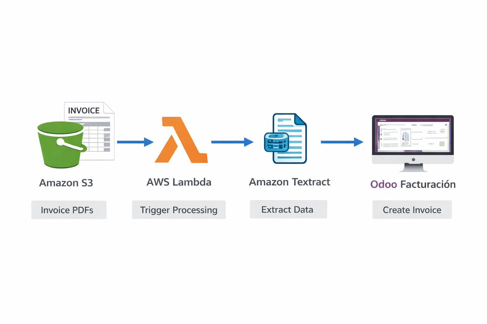

## Steps
La Factura Ficticia de Prueba


Captura de pantalla del siguiente bloque (o cópialo en un documento de Word y guárdalo como PDF/JPG). Nómbralo factura_demo.jpg.
```
    TECH SUPPLIES S.L.
    NIF: B-12345678
    Calle Falsa 123, Madrid, España

    FACTURA A:
    Tu Empresa S.A.

    Nº Factura: F-2026-0042
    Fecha: 04-04-2026
    Descripción	Cantidad	Precio Unitario	Total
    Servidor Dell PowerEdge R740	1	2500.00	2500.00
    Licencia de Software Anual	1	500.00	500.00

    SUBTOTAL: 3000.00
    IVA (21%): 630.00
    TOTAL A PAGAR: 3630.00 €
```
Fase 1: Preparación en Odoo

Para que la Lambda pueda crear la factura, Odoo debe tener el módulo de contabilidad o facturación instalado.

    Entra a tu Odoo y ve a Aplicaciones (Apps).

    Instala la aplicación Facturación (Invoicing) o Contabilidad (Accounting).
    (El modelo técnico que usa Odoo para las facturas de proveedor es account.move con el tipo in_invoice).

Fase 2: Amazon S3 (La Bandeja de Entrada)

    Ve a S3 > Crear bucket.

    Llámalo buzon-facturas-ai-tuapellido (el nombre debe ser único).

    Déjalo todo por defecto y créalo.

Fase 3: La Función Lambda (El Cerebro)

Esta función se despertará cuando subas la foto, se la pasará a Textract, extraerá los datos clave y los inyectará en Odoo.

    Ve a Lambda > Crear función. Llámala OdooInvoiceAI (Python 3.12).

    En Permisos (Cambiar rol de ejecución predeterminado), selecciona Usar un rol existente y elige tu RolLambdaFacturasAI.

    Pega este código exacto:

Python
```
import json
import boto3
import urllib.parse
import xmlrpc.client
import os

# --- CONFIGURACIÓN DE ODOO ---
# (Recomendado: poner esto en Variables de Entorno de la Lambda)
ODOO_URL = os.environ.get('ODOO_URL', 'http://TU_IP_DE_EC2:8069')
ODOO_DB = os.environ.get('ODOO_DB', 'odoo_produccion')
ODOO_USER = os.environ.get('ODOO_USER', 'tu_email_admin@empresa.com')
ODOO_PASSWORD = os.environ.get('ODOO_PASSWORD', 'tu_contraseña')

# Inicializar clientes de AWS
s3 = boto3.client('s3')
textract = boto3.client('textract')

def lambda_handler(event, context):
    try:
        # 1. Obtener el nombre del bucket y del archivo que acaba de subir
        bucket = event['Records'][0]['s3']['bucket']['name']
        key = urllib.parse.unquote_plus(event['Records'][0]['s3']['object']['key'])
        
        print(f"📄 Procesando factura: s3://{bucket}/{key}")
        
        # 2. Llamar a la IA especializada en facturas de Textract
        response = textract.analyze_expense(
            Document={'S3Object': {'Bucket': bucket, 'Name': key}}
        )
        
        # 3. Extraer los datos inteligentemente
        total = 0.0
        fecha = "Desconocida"
        proveedor = "Proveedor Escaneado con IA"
        
        for expense_doc in response['ExpenseDocuments']:
            for field in expense_doc['SummaryFields']:
                field_type = field.get('Type', {}).get('Text')
                field_value = field.get('ValueDetection', {}).get('Text', '')
                
                if field_type == 'TOTAL':
                    # Limpiar símbolo de euro o texto para quedarnos con el número
                    num_str = field_value.replace('€', '').replace(',', '.').strip()
                    try:
                        total = float(num_str)
                    except ValueError:
                        pass
                elif field_type == 'INVOICE_RECEIPT_DATE':
                    fecha = field_value
                elif field_type == 'VENDOR_NAME':
                    proveedor = field_value

        print(f"🤖 Datos extraídos -> Proveedor: {proveedor} | Total: {total} | Fecha: {fecha}")
        
        # 4. Inyectar en Odoo vía XML-RPC
        common = xmlrpc.client.ServerProxy(f'{ODOO_URL}/xmlrpc/2/common')
        uid = common.authenticate(ODOO_DB, ODOO_USER, ODOO_PASSWORD, {})
        
        if not uid:
            raise Exception("Error de autenticación con Odoo")
            
        models = xmlrpc.client.ServerProxy(f'{ODOO_URL}/xmlrpc/2/object')
        
        # 4.1 Buscar o crear el proveedor en Odoo
        partner_ids = models.execute_kw(ODOO_DB, uid, ODOO_PASSWORD, 'res.partner', 'search', [[('name', '=', proveedor)]])
        if partner_ids:
            partner_id = partner_ids[0]
        else:
            partner_id = models.execute_kw(ODOO_DB, uid, ODOO_PASSWORD, 'res.partner', 'create', [{
                'name': proveedor,
                'supplier_rank': 1, # Es un proveedor
                'comment': 'Creado automáticamente por AWS Textract'
            }])
            
        # 4.2 Crear el borrador de la factura (Vendor Bill)
        invoice_id = models.execute_kw(ODOO_DB, uid, ODOO_PASSWORD, 'account.move', 'create', [{
            'move_type': 'in_invoice', # Tipo: Factura de proveedor
            'partner_id': partner_id,
            'ref': f"Factura escaneada - Fecha original: {fecha}",
            # Añadimos una línea de detalle con el total detectado
            'invoice_line_ids': [
                (0, 0, {
                    'name': 'Importe detectado por IA (Revisar)',
                    'price_unit': total,
                    'quantity': 1
                })
            ]
        }])
        
        print(f"✅ ¡Éxito! Factura borrador creada en Odoo con ID: {invoice_id}")
        return {"statusCode": 200, "body": f"Factura {invoice_id} creada."}

    except Exception as e:
        print(f"❌ Error crítico: {str(e)}")
        raise e
```
(Cambia las credenciales de Odoo o añádelas a las Variables de Entorno de Lambda. Súper Importante: Si vas a procesar PDFs, Textract synchronous API solo soporta PDFs de una sola página. Para el lab, subir un JPG/PNG es lo más rápido).
Fase 5: El Disparador (Trigger) de S3

Para que todo funcione sin intervención humana, unimos S3 con Lambda.

    Estando dentro de tu función Lambda, haz clic en Añadir desencadenador (Add trigger).

    Selecciona S3.

    Selecciona tu bucket (buzon-facturas-ai-tuapellido).

    Tipo de evento: PUT (Se activa al crear/subir un objeto).

    Marca la casilla de confirmación y dale a Añadir.

¡Prueba el Laboratorio!

    Ve a tu bucket de S3.

    Sube la imagen factura_demo.jpg que creaste.

    Ve rápidamente a CloudWatch (o a la pestaña Monitor de tu Lambda) y mira los logs. Verás a la IA detectando "TECH SUPPLIES S.L." y "3630.00".

    Abre tu ERP Odoo, ve a la aplicación de Facturación > Proveedores > Facturas (Invoicing > Vendors > Bills).
