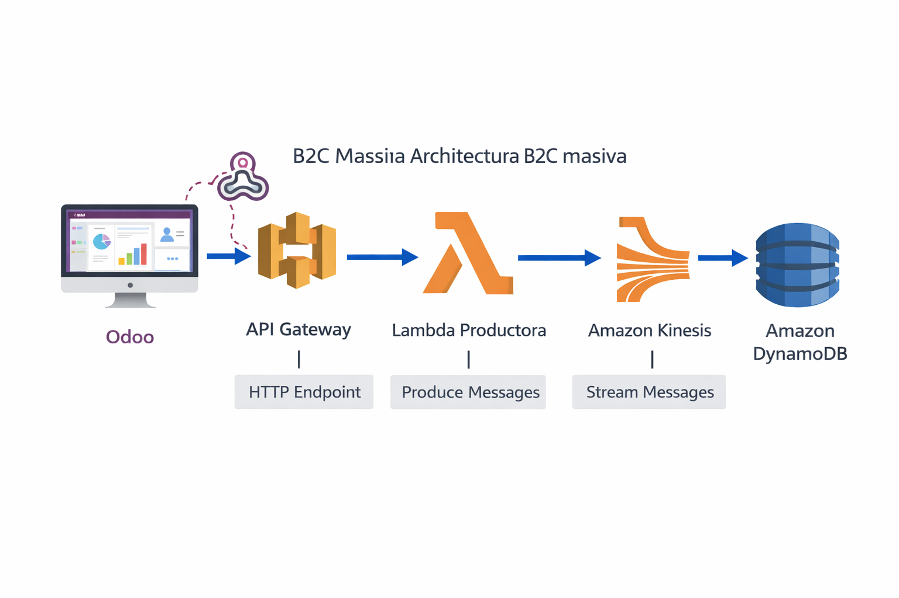

Esta es la arquitectura B2C masiva. Odoo Webhook -> API Gateway -> Lambda Productora -> Kinesis -> Lambda Consumidora -> DynamoDB.

## Steps
Al introducir Amazon Kinesis en medio, estamos creando un "Amortiguador" (Shock Absorber). Si mañana en Odoo se hace una importación masiva que actualiza 500.000 precios de golpe, el Webhook disparará 500.000 peticiones en segundos. Si atacamos a DynamoDB directamente, podríamos saturarlo o disparar los costes de escritura. Kinesis se traga esos 500.000 eventos sin inmutarse, los encola, y la Lambda final los va procesando e insertando en DynamoDB a un ritmo constante y seguro.

Vamos paso a paso:
Fase 1: DynamoDB (El Catálogo Ultrarrápido)

    Ve a DynamoDB > Crear tabla.

    Nombre: CatalogoB2C.

    Clave de partición: product_id (Cadena).

    Crear tabla.

Fase 2: Amazon Kinesis (La Autopista de Eventos)

Aquí crearemos el "tubo" por donde viajarán los eventos a toda velocidad.

    Ve a la consola de AWS y busca Kinesis.

    Selecciona Kinesis Data Streams y dale a Create data stream.

    Data stream name: OdooProductUpdates.

    Capacity mode: Selecciona On-demand (Bajo demanda). Esto hace que Kinesis escale automáticamente si hay picos.

    Haz clic en Create data stream.

Fase 3: La Lambda "Productora" (La Puerta de Entrada)

Esta Lambda recibe el golpe masivo del Webhook de Odoo y simplemente "escupirá" los datos dentro del tubo de Kinesis lo más rápido posible.

    Ve a Lambda > Crear función. Llámala ApiToKinesisProducer (Python 3.12).

    En la pestaña Configuración > Permisos, abre su rol de ejecución y asegúrate de añadirle la política AmazonKinesisFullAccess para que pueda meter datos en el tubo.

    Pega este código:

Python
```
import json
import boto3
import os

kinesis = boto3.client('kinesis')
STREAM_NAME = os.environ.get('STREAM_NAME', 'OdooProductUpdates')

def lambda_handler(event, context):
    try:
        # Cogemos el JSON crudo que manda Odoo
        body = event.get('body', '{}')
        
        # Validamos rápidamente que sea un JSON válido
        parsed_body = json.loads(body)
        
        # Inyectamos el evento crudo en la autopista Kinesis
        # Usamos una PartitionKey fija porque el orden estricto no es crítico aquí
        response = kinesis.put_record(
            StreamName=STREAM_NAME,
            Data=body, 
            PartitionKey="odoo_webhook_partition"
        )
        
        print(f"🚀 Evento empujado a Kinesis: Shard {response['ShardId']}")
        
        # Devolvemos un 200 ultrarrápido a Odoo para no bloquearlo
        return {
            'statusCode': 200,
            'body': json.dumps({'message': 'Evento encolado en Kinesis'})
        }
    except Exception as e:
        print(f"❌ Error al enviar a Kinesis: {str(e)}")
        return {
            'statusCode': 500,
            'body': json.dumps({'error': str(e)})
        }
```
Haz Deploy.
Fase 4: API Gateway (El Enchufe de Odoo)

    Ve a API Gateway > Crear API > API REST.

    Nombre: KinesisIngestionAPI.

    Crea un recurso (/update) y un método POST apuntando a tu función Lambda ApiToKinesisProducer.

    Implementa la API en una etapa prod.

    Copia la URL de Invocación.

Fase 5: La Lambda "Consumidora" (El Procesador Final)

Esta Lambda bebe de la autopista Kinesis a su propio ritmo, saca los datos y los escribe bonito en DynamoDB.

    Ve a Lambda > Crear función. Llámala KinesisToDynamoConsumer (Python 3.12).

    Permisos vitales: Su rol debe tener AmazonDynamoDBFullAccess y AWSLambdaKinesisExecutionRole (esta última le permite leer el flujo de Kinesis de forma continua).

    El Desencadenador (Trigger):

        Haz clic en Añadir desencadenador.

        Selecciona Kinesis.

        Selecciona tu flujo OdooProductUpdates.

        Batch size (Tamaño del lote): Pon 100. (Esto significa que si Odoo manda 100 precios de golpe, Kinesis se los mandará a esta Lambda todos juntos en una sola ejecución para ahorrar dinero).

        Dale a Añadir.

    Pega este código:

Python
```
import json
import boto3
import base64
from datetime import datetime

dynamodb = boto3.resource('dynamodb')
table = dynamodb.Table('CatalogoB2C')

def lambda_handler(event, context):
    # Kinesis manda los eventos en lotes (Records), iteramos sobre ellos
    for record in event['Records']:
        try:
            # Los datos en Kinesis viajan en Base64 por seguridad/eficiencia, hay que decodificarlos
            payload_decodificado = base64.b64decode(record['kinesis']['data']).decode('utf-8')
            body = json.loads(payload_decodificado)
            
            # Odoo Webhook manda los datos en una lista, extraemos el primero
            if isinstance(body, list) and len(body) > 0:
                data = body[0]
            else:
                data = body
                
            product_id = str(data.get('id', '0'))
            name = data.get('name', 'Sin nombre')
            price = str(data.get('list_price', '0.0')) 
            
            # Escribimos en el catálogo final (Modelo de Lectura)
            item = {
                'product_id': product_id,
                'name': name,
                'price': price,
                'last_updated': datetime.utcnow().isoformat()
            }
            
            table.put_item(Item=item)
            print(f"✅ Procesado desde Kinesis a DynamoDB: {name} ({price}€)")
            
        except Exception as e:
            print(f"❌ Error procesando registro de Kinesis: {str(e)}")
            # En producción se enviaría a una SQS Dead Letter Queue (DLQ)
            continue 
```
Haz Deploy.
Fase 6: Odoo (El Disparador Nativo)

Finalmente, conectamos el ERP usando su función nativa de Webhooks para evitar problemas de seguridad con Python.

    Entra a Odoo con el Modo Desarrollador activado.

    Instalar el módulo de Automatización

    Ve al menú principal de Odoo y entra en Aplicaciones (Apps).

    En la barra de búsqueda de arriba, borra el filtro "Aplicaciones" (haz clic en la X de la etiqueta). Esto es crucial, porque si no lo borras, Odoo oculta los módulos técnicos.

    Escribe en el buscador: base_automation (o "Automated Actions" / "Acciones automatizadas").

    Te aparecerá el módulo correspondiente. Haz clic en Activar (o Instalar).

Una vez que Odoo termine de cargar, vuelve a Ajustes > Técnico > Automatización.

    Ve a Ajustes > Técnico > Automatización > Acciones Automatizadas.

    Dale a Nuevo:

        Nombre: Ingesta Masiva Kinesis B2C

        Modelo: Product Template (product.template)

        Desencadenante: Al crear o actualizar (On Creation & Update).

        Acción a realizar: Enviar Webhook (Send Webhook).

        URL: Pega aquí la URL de tu API Gateway.

        Campos: Añade name y list_price.

    Guarda.

El Test de Estrés (La magia de Streaming)

Para probarlo:

    Cambia el precio de un producto en Odoo.

    Al pulsar guardar, Odoo lanza el Webhook a API Gateway.

    La Lambda productora lo captura y lo tira a Kinesis.

    Kinesis lo empaqueta y despierta a la Lambda consumidora.

    La Lambda consumidora lo lee y lo guarda en DynamoDB.

¿Por qué es esto Arquitectura Masiva?
 Odoo nunca esperará a que DynamoDB termine de escribir. El Webhook toca API Gateway, entra en Kinesis e inmediatamente le dice a Odoo "Ya está, sigue trabajando". Si DynamoDB se cae o está lento, los eventos se quedan almacenados de forma segura dentro de Kinesis hasta 365 días. Odoo nunca se bloquea, y los datos nunca se pierden.

## Kinesis y CQRS
 CQRS puro y Event Sourcing, Kinesis esconde superpoderes que cambian por completo las reglas del juego.
 1. El patrón "Fan-Out" (El Efecto Megáfono)

En CQRS, el modelo de lectura (Query) no tiene por qué ser una sola base de datos. A veces necesitas que un mismo dato se lea de formas diferentes.
Kinesis permite que múltiples consumidores lean el mismo evento a la vez sin molestarse entre ellos.

    Odoo lanza: "El producto X ha cambiado de precio y descripción".

    Kinesis lo difunde a:

        Lambda 1: Lo guarda en DynamoDB para que la web B2C lo lea rápido.

        Lambda 2: Lo manda a Amazon OpenSearch (Elasticsearch) para que el buscador predictivo de la web sepa de la nueva descripción.

        Kinesis Firehose: Lo guarda en tu Data Lake de S3 (el del Módulo 6) para el histórico analítico.
        ¡Un solo evento de Odoo ha alimentado tres sistemas distintos simultáneamente!

2. Event Sourcing y el "Replay" (La Máquina del Tiempo)

Este es el concepto central del Event Sourcing. Kinesis no solo transporta datos; los guarda (hasta por 365 días).
Imagina que un desarrollador comete un error fatal y borra la tabla CatalogoB2C de DynamoDB, o que el equipo de Marketing decide que ahora necesitan que DynamoDB tenga una estructura diferente.

    Con una base de datos normal, estarías en pánico restaurando backups.

    Con Kinesis, simplemente creas una tabla nueva en DynamoDB, apuntas tu Lambda al principio del flujo de Kinesis (configurando StartingPosition: TRIM_HORIZON) y dejas que vuelva a procesar (Replay) todos los cambios de precios del último año a toda velocidad. En minutos, has reconstruido tu base de datos de lectura desde cero usando el historial inmutable de eventos.

3. Garantía de Orden Estricto (Evitar el caos)

Imagina que un comercial en Odoo cambia el precio de unas zapatillas a 100€ y, dos segundos después, se da cuenta de un error y lo baja a 80€.
Si lanzaras esos dos eventos sueltos a la red (sin Kinesis), por la latencia de internet, el de 80€ podría llegar a DynamoDB antes que el de 100€. El resultado final en la web sería 100€ (el dato viejo sobreescribiría al nuevo).

    La magia de Kinesis: ¿Recuerdas que en el código de la Lambda Productora usamos una PartitionKey? Si usamos el product_id como Partition Key, Kinesis garantiza matemáticamente que todos los eventos del mismo producto viajan por el mismo "carril" (Shard) y en orden estricto (FIFO). El precio de 80€ jamás se procesará antes que el de 100€.

4. Analítica en Tiempo Real (Ventanas de Tiempo)

Si pasas los datos por Kinesis, puedes conectar un servicio llamado Amazon Managed Service for Apache Flink (antes Kinesis Data Analytics) para analizar los eventos "al vuelo" antes de que toquen ninguna base de datos.

    Caso de uso espectacular: Si de repente Odoo lanza eventos diciendo que el precio de 50 productos top ventas ha caído a 0,01€ (un error humano catastrófico), Flink puede detectar que hay una "anomalía de ventana de tiempo", bloquear el envío a DynamoDB y disparar una alarma al móvil del director de IT. ¡Has salvado al e-commerce de vender gratis antes de que el catálogo público se actualice!

En resumen: Kinesis no es solo un tubo que evita saturaciones. Es la "Fuente de la Verdad" (Source of Truth) que orquesta a todos los sistemas de lectura de la empresa de forma segura, ordenada y escalable.

## Tips

Si DynamoDB puede absorber millones de escrituras por segundo, ¿por qué ponemos a Kinesis en medio? ¿Por qué no ir directamente de la Lambda a DynamoDB?

La respuesta esconde tres "trampas" de la vida real en AWS:
1. La Trampa del "Escalado Instantáneo" (Throttling)

DynamoDB tiene dos modos: Provisionado (fijo) y Bajo Demanda (On-Demand).
Si usas On-Demand, DynamoDB escala automáticamente, pero no instantáneamente desde cero a infinito. Su regla interna es que puede absorber inmediatamente el doble de tu pico histórico anterior.
Si tu web normalmente recibe 100 actualizaciones por segundo, y de golpe en un solo segundo le inyectas 500.000 (porque alguien importó un Excel masivo en Odoo), DynamoDB te va a estrangular (Throttling) durante los primeros minutos hasta que escale sus particiones. Devolverá errores HTTP 429 Too Many Requests.
2. Proteger a Odoo (El efecto "Backpressure")

¿Qué pasa si DynamoDB devuelve ese error 429?
Si tu arquitectura es Odoo -> API Gateway -> Lambda -> DynamoDB, el error "rebota" y viaja de vuelta hasta Odoo. El ERP se quedará esperando, reintentando, y la transacción de la base de datos PostgreSQL de Odoo se quedará bloqueada. ¡Podrías colgar el ERP de toda la empresa porque DynamoDB tardó 3 minutos en calentar sus motores!
Con Kinesis, la Lambda de entrada solo empuja el mensaje al tubo y devuelve un HTTP 200 OK a Odoo en 10 milisegundos. Odoo cierra su transacción y sigue feliz. Si DynamoDB se estrangula, Kinesis simplemente espera pacientemente y lo reintenta sin molestar a Odoo.
3. La Factura a Fin de Mes (Micro-Batching)

DynamoDB cobra por millón de escrituras, lo cual es barato. Pero API Gateway y Lambda te cobran por cada invocación.

    Sin Kinesis: 500.000 precios = 500.000 peticiones a API Gateway + 500.000 ejecuciones de Lambda individuales. (Más caro y propenso a agotar el límite de concurrencia de Lambdas de tu cuenta, que suele ser de 1.000 simultáneas).

    Con Kinesis: Kinesis empaqueta los eventos. Puedes configurar la Lambda consumidora para que lea lotes de 1.000 en 1.000. El resultado: solo 500 ejecuciones de Lambda, que usarán la operación BatchWriteItem de DynamoDB. El coste cae en picado y la eficiencia de la red se dispara.

4. Requisitos del Patrón CQRS Puro

En la teoría estricta de CQRS y Event Sourcing, DynamoDB es tu "Vista Actual" (State), pero Kinesis es tu "Registro de Eventos" (Event Store).
Si solo usas DynamoDB y un precio cambia 3 veces en un minuto, solo verás el último número. El historial de qué pasó, en qué orden y cuándo se ha perdido. Kinesis guarda ese historial inmutable, permitiéndote auditar o reconstruir los datos en el futuro.

En resumen: No ponemos Kinesis porque DynamoDB sea débil, lo ponemos para proteger a Odoo de los rebotes, para no arruinarnos con las invocaciones de Lambda, y para absorber picos anómalos de "Cero a Cien" sin romper nada.
