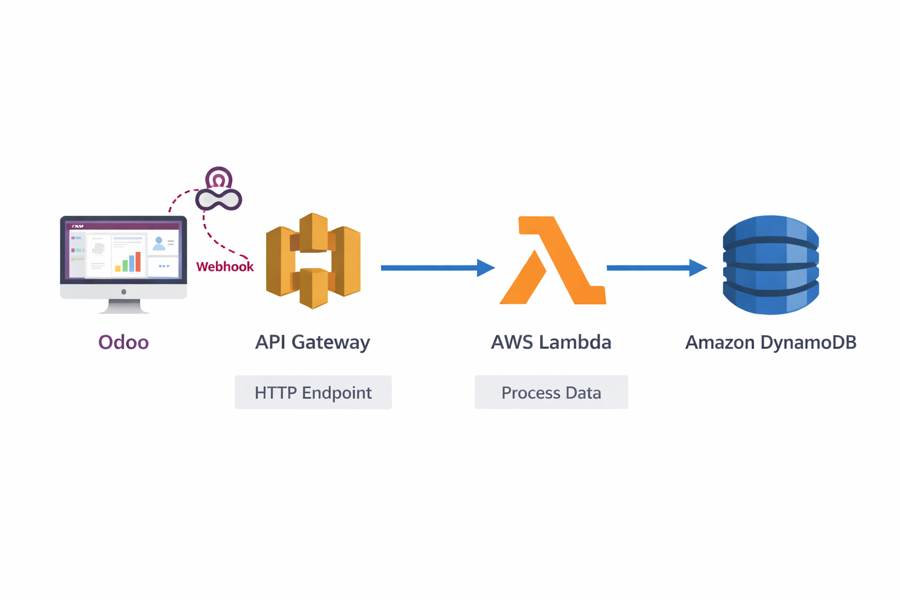

## Steps
El patrón CQRS (Segregación de Responsabilidades de Comando y Consulta) es lo que usan gigantes como Netflix, Amazon o Uber para que sus catálogos no se caigan en Black Friday.

En Odoo, cuando un usuario guarda un producto, ocurren decenas de validaciones en PostgreSQL (cálculo de impuestos, rutas de stock, contabilidad...). Eso es perfecto para Escribir (Command), pero es lentísimo para Leer (Query) un millón de veces por segundo en una web pública.

Vamos a dividir el sistema en dos. Odoo será nuestro "Comando" (donde se cambian los precios), y DynamoDB será nuestra "Consulta" (donde la web pública leerá el catálogo a la velocidad de la luz).


Fase 1: Amazon DynamoDB (La Base de Datos de Lectura)

Esta será la base de datos que consumirá el frontend B2C. Solo contendrá los datos finales y listos para ser leídos, sin relaciones complejas.

    Ve a la consola de AWS > DynamoDB > Crear tabla.

    Nombre de la tabla: CatalogoB2C

    Clave de partición: product_id (Tipo: Cadena / String).

    Deja lo demás por defecto y dale a Crear tabla.

Fase 2: La Función Lambda (El "Event Handler")

Esta función será la encargada de recibir el aviso de Odoo y actualizar el catálogo en DynamoDB.

    Ve a Lambda > Crear función. Llámala SyncProductCQRS (Python 3.12).

    En Permisos, asegúrate de que el rol tenga permisos para escribir en DynamoDB (AmazonDynamoDBFullAccess o una política específica para PutItem).

    Pega este código:

Python
```
import json
import boto3
from datetime import datetime

dynamodb = boto3.resource('dynamodb')
table = dynamodb.Table('CatalogoB2C')

def lambda_handler(event, context):
    try:
        # Extraemos el evento que nos manda Odoo
        body = json.loads(event.get('body', '{}'))
        
        product_id = str(body.get('id'))
        name = body.get('name', 'Sin nombre')
        price = str(body.get('price', '0.0')) # DynamoDB maneja mejor los decimales como strings
        
        print(f"🔄 EVENTO RECIBIDO: Actualizando producto {name} (ID: {product_id}) a {price}€")
        
        # CQRS: Guardamos una vista "Plana" (Proyección) optimizada para lectura rápida
        item = {
            'product_id': product_id,
            'name': name,
            'price': price,
            'last_updated': datetime.utcnow().isoformat(),
            'status': 'disponible'
        }
        
        table.put_item(Item=item)
        
        return {
            'statusCode': 200,
            'body': json.dumps({'mensaje': 'Catálogo de lectura actualizado (CQRS)'})
        }
    except Exception as e:
        print(f"❌ Error: {str(e)}")
        return {
            'statusCode': 500,
            'body': json.dumps({'error': str(e)})
        }
```
Guárdalo y dale a Deploy.
Fase 3: Amazon API Gateway (El Endpoint del Evento)

    Ve a API Gateway > Crear API > API REST (Construir).

    Nombre: CQRS_Events.

    Crea un recurso (/sync) y un método POST apuntando a tu función Lambda SyncProductCQRS.

    Implementa (Deploy) la API en una etapa llamada prod.

    Copia la URL de Invocación (Terminará en /prod/sync).


Fase 4: Odoo (El Disparador del Comando)

Ahora vamos a decirle a Odoo: "Cada vez que un comercial cambie un precio, dispara un evento a AWS".

    Entra a tu Odoo como administrador.

     Activa el Modo Desarrollador: (Ajustes > Activar modo desarrollador, al final de la página).

  Instalar el módulo de Automatización

    Ve al menú principal de Odoo y entra en Aplicaciones (Apps).

    En la barra de búsqueda de arriba, borra el filtro "Aplicaciones" (haz clic en la X de la etiqueta). Esto es crucial, porque si no lo borras, Odoo oculta los módulos técnicos.

    Escribe en el buscador: base_automation (o "Automated Actions" / "Acciones automatizadas").

    Te aparecerá el módulo correspondiente. Haz clic en Activar (o Instalar).

Una vez que Odoo termine de cargar, vuelve a Ajustes > Técnico > Automatización.

    Ve a Ajustes > Técnico > Automatización > Acciones Automatizadas (Automated Actions).

    Dale a Nuevo:

        Nombre: Evento CQRS - Sincronizar Catálogo

        Modelo: Product Template (product.template)

        Desencadenante (Trigger): Al crear o actualizar (On Creation & Update).

En el campo Acción a realizar (Action To Do), cambia "Ejecutar código Python" y selecciona Enviar Webhook (Send Webhook).

Verás que la pantalla cambia y te pide nuevos datos:

    URL: Pega aquí la dirección de tu API Gateway de AWS (https://tu-api-id.execute-api.us-east-1.amazonaws.com/prod/sync).

    Campos (Fields): Odoo te permite elegir qué datos del producto quieres enviar a AWS. Añade los campos name (Nombre) y list_price (Precio de venta).

Guarda la acción automatizada.

¡La Prueba Final del Patrón CQRS!

Para demostrar a tus alumnos que esto funciona:

El Lado "Command" (Escritura):

    Que un alumno vaya en Odoo a Ventas > Productos.

    Que cree un producto nuevo llamado "Zapatillas Edición Limitada" y le ponga un precio de 150.00.

    Al darle a Guardar, Odoo hace su trabajo transaccional pesado en PostgreSQL y, en silencio, lanza el evento a AWS.

El Lado "Query" (Lectura):

    Que vayan a la consola de AWS > DynamoDB > Explorar elementos (Explore Items).

    Entren a su tabla CatalogoB2C.

    ¡Ahí estará la zapatilla de 150.00€!

"¿Qué pasa si la web del cliente (e-commerce) hace un millón de peticiones a DynamoDB en este mismo segundo?"
Respuesta: DynamoDB las servirá en 2 milisegundos gracias a su diseño NoSQL. ¿Y Odoo? Odoo no recibirá ni una sola petición de lectura. Su CPU estará al 0%, protegiendo a los comerciales que siguen trabajando dentro del ERP sin notar lentitud. Hemos separado con éxito las escrituras de las lecturas. ¡Eso es CQRS puro!
