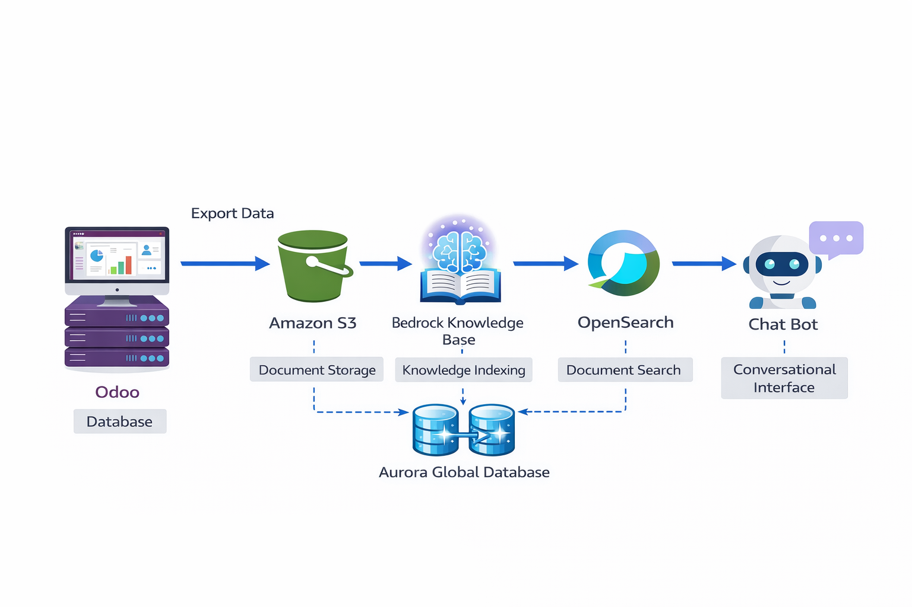

## Steps
RAG (Retrieval-Augmented Generation) es lo que separa a un simple bot de ChatGPT de un verdadero Asistente Corporativo Seguro.

Al usar RAG, le quitamos al modelo de IA la capacidad de inventar cosas (alucinar). En su lugar, le decimos: "Lee estos manuales oficiales de Odoo, y responde SOLO usando esta información".

Para hacer este laboratorio rápido, moderno y sin que los alumnos se pierdan en complejas configuraciones de red, vamos a utilizar la característica más nueva y potente de AWS: Knowledge Bases for Amazon Bedrock. Esta herramienta automatiza la creación del clúster de OpenSearch y la vectorización por debajo.

Aquí tienes los documentos de ejemplo y la receta paso a paso.
📄 Documentos de Ejemplo (Base de Conocimiento de Odoo)

Crea estos dos archivos de texto en tu ordenador. Serán nuestra "Knowledge Base" exportada de Odoo.

Archivo 1: Politica_Devoluciones_Odoo.txt
Plaintext
```
TÍTULO: Procedimiento de Devolución de Material Defectuoso (RMA)
DEPARTAMENTO: Almacén y Compras
SISTEMA: Odoo Módulo Inventario (v19)

Cuando un empleado necesite devolver un equipo informático defectuoso, debe seguir estos pasos exactos en Odoo:
1. Ir al menú principal y abrir la aplicación "Inventario".
2. En el panel superior, hacer clic en "Operaciones" y seleccionar "Devoluciones (RMA)".
3. Hacer clic en el botón "Nuevo".
4. En el campo "Documento Origen", introducir el número de albarán original de entrega.
5. Seleccionar el producto a devolver y en "Motivo", escribir obligatoriamente una descripción del fallo.
6. Guardar y validar. Esto generará un movimiento de stock al "Almacén de Chatarra/Devoluciones".
Nota: Las devoluciones de ordenadores portátiles requieren aprobación previa del departamento de IT.
```
Archivo 2: Solicitud_Vacaciones_Odoo.txt
Plaintext
```
TÍTULO: Solicitud de Ausencias y Vacaciones
DEPARTAMENTO: Recursos Humanos
SISTEMA: Odoo Módulo Ausencias (Time Off)

Para solicitar días de vacaciones, el empleado debe usar Odoo de la siguiente manera:
1. Abrir la aplicación "Ausencias" (Time Off) desde el menú principal de Odoo.
2. Hacer clic en "Nueva Solicitud" (New Time Off).
3. Seleccionar el Tipo de Ausencia: "Vacaciones Pagadas".
4. Seleccionar las fechas de inicio y fin en el calendario.
5. Hacer clic en Guardar.
IMPORTANTE: Las solicitudes deben hacerse con un mínimo de 15 días de antelación. Si la solicitud es por "Baja Médica", no requiere preaviso, pero se debe adjuntar el parte médico escaneado en el botón "Adjuntar archivo".
```
Fase 1: Amazon S3 (Tu Biblioteca Corporativa)

Vamos a subir estos manuales crudos a la nube.

    Ve a Amazon S3 y dale a Crear bucket.

    Llámalo odoo-knowledge-base-tuapellido. Déjalo todo por defecto (Privado) y créalo.

    Entra en el bucket y sube los dos archivos .txt que acabamos de crear.

Fase 2: Habilitar Modelos en Amazon Bedrock

Bedrock requiere que pidas permiso (gratuito) para usar los modelos de IA antes de empezar.

    Ve a la consola de AWS y busca Amazon Bedrock.

    En el menú izquierdo, baja hasta Model access (Acceso a modelos).

    Haz clic arriba a la derecha en Enable specific models (o Manage model access).

    Activa las casillas de:

        Titan Embeddings G1 - Text (El modelo matemático que convertirá tus textos en vectores).

        Claude 3 Haiku o Claude 3 Sonnet de Anthropic (El cerebro que hablará con el usuario).

    Dale a guardar y espera unos minutos a que el estado cambie a "Access granted" (Acceso concedido).

Fase 3: Crear el "Cerebro RAG" (Knowledge Base)

Aquí es donde AWS hace la magia. Crearemos un flujo que lee tu S3, vectoriza los textos y crea OpenSearch Serverless de forma automática.

    En el menú izquierdo de Bedrock, bajo Builder tools, haz clic en Knowledge bases.

    Haz clic en Create knowledge base.

    Paso 1 (Detalles): Ponle de nombre Odoo_Copilot. Selecciona crear un nuevo rol de IAM. Dale a Next.

    Paso 2 (Data Source): Selecciona tu bucket de S3 (odoo-knowledge-base-tuapellido). Dale a Next.

    Paso 3 (Embeddings y Vector DB):

        En Embeddings model, selecciona Titan Embeddings G1 - Text.

        En Vector database, selecciona Quick create a new Amazon OpenSearch Serverless vector store (¡Esto te ahorra horas de configuraciones de red complejas!).

    Dale a Next, revisa todo y haz clic en Create knowledge base.

Atención: AWS tardará unos 5-10 minutos en aprovisionar la base de datos OpenSearch Serverless por debajo.
Fase 4: Sincronizar (Vectorizar los datos)

La base de datos está creada, pero está vacía. Tenemos que decirle que lea los .txt de tu S3.

    Cuando la Knowledge Base termine de crearse, verás una sección llamada Data source con tu bucket de S3.

    Selecciona esa fila y pulsa el botón Sync (Sincronizar).

    Bedrock cogerá tus archivos, los partirá en trozos (chunks), los convertirá en vectores matemáticos usando Titan, y los guardará en OpenSearch. El estado cambiará a Ready cuando acabe.

La Prueba Final: Hablando con el Copiloto de Odoo

  ¡Hora de la demostración para la clase! No necesitamos programar una web frontend para probarlo, Bedrock trae un entorno de pruebas brutal integrado.

    En la misma pantalla de tu Knowledge Base, fíjate en el panel de la derecha: Test knowledge base.

    Haz clic en Select model y elige Claude 3 Haiku (o Sonnet).

    Aparecerá un chat. Hazle esta pregunta "trampa" a la IA:

    "Hola, soy un empleado nuevo. Necesito devolver un portátil que me ha llegado roto. ¿Cómo lo hago en Odoo?"

La Magia del RA. La IA no te dará una respuesta genérica sobre cómo funcionan las devoluciones en el mundo. Hará lo siguiente:

    Convertirá tu pregunta en un vector.

    Buscará en OpenSearch qué trozo de documento se parece a esa pregunta.

    Encontrará tu archivo Politica_Devoluciones_Odoo.txt.

    Claude 3 te responderá conversacionalmente: "Para devolver un portátil defectuoso, debes ir a la aplicación Inventario en Odoo, seleccionar Operaciones > Devoluciones (RMA) y generar un nuevo documento referenciando el albarán original. Ten en cuenta que al ser un portátil, necesitarás la aprobación previa del departamento de IT."


Si te fijas en el chat de Bedrock, debajo de la respuesta de la IA aparecerá un numerito (ej. [1]). Si haces clic en él, te dirá exactamente de qué archivo de S3 sacó esa información.
