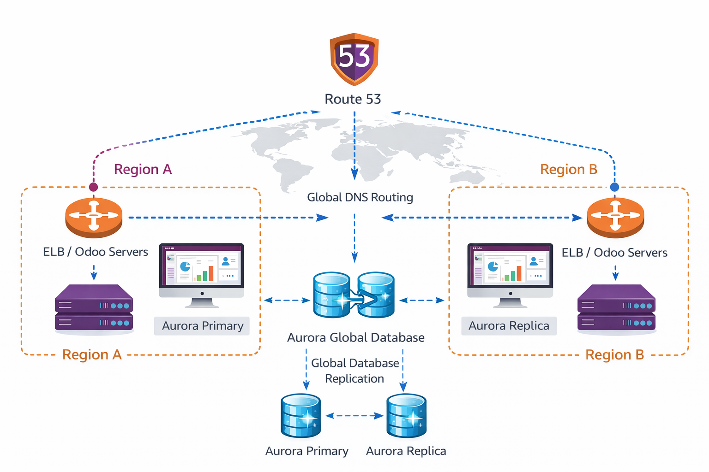

## Steps

Desplegar Odoo en múltiples continentes tiene una trampa gigantesca que muy poca gente conoce: Odoo no está diseñado para bases de datos "Activo-Activo". Odoo espera una sola base de datos PostgreSQL maestra. Si intentas poner dos bases de datos maestras sincronizándose, los IDs chocarán y el ERP se corromperá.

¿Cómo resolvemos esto como expertos en AWS? Usando un "truco de magia" exclusivo de Amazon Aurora llamado Write Forwarding (Reenvío de escritura local). Esto permite que el Odoo de Oregon lea datos localmente (a 1 milisegundo) y, cuando alguien pulsa "Guardar", Aurora enruta esa escritura internamente a Virginia a través de la red privada intercontinental de AWS, sin que Odoo se entere de nada.

Aquí tienes la guía paso a paso para montar este gigante transcontinental entre Norte de Virginia (us-east-1) y Oregon (us-west-2).
Fase 1: Amazon Aurora Global Database (El Corazón Global)

Vamos a crear una base de datos que cruza todo Estados Unidos de costa a costa.

    Crear el Clúster Primario (N. Virginia):

        Ve a RDS en la región de Norte de Virginia (us-east-1).

        Haz clic en Crear base de datos.

        Selecciona Amazon Aurora y el motor PostgreSQL-Compatible.

        Elige la plantilla Producción o Dev/Test.

        Crea el clúster (llámalo odoo-db-primaria).

    Convertirlo en Global:

        Una vez que el clúster primario esté "Disponible", selecciónalo, haz clic en Acciones y elige Añadir región de AWS (Add AWS Region).

        En Región secundaria, selecciona US West (Oregon).

        El Secreto del Arquitecto (Paso Crítico): En la configuración avanzada de esta nueva región, busca la opción Reenvío de escritura local (Local Write Forwarding) y actívala. Esto es lo que simula el Activo-Activo para Odoo.

        Haz clic en Añadir región.

(AWS tardará unos minutos en crear el clúster de Oregon y sincronizar los datos de forma continua y asíncrona).

Fase 2: El Cómputo (EC2 con Odoo en cada costa)

Ahora levantamos los servidores web de Odoo, asegurándonos de que cada uno se conecta a su base de datos local.

    Odoo en Virginia (us-east-1):

        Lanza tu máquina EC2 con Docker/Odoo en N. Virginia.

        En tu archivo de configuración docker-compose.yaml, en la variable HOST=..., pon el Punto de enlace (Endpoint) del clúster de Virginia.

    Odoo en Oregon (us-west-2):

        Cambia tu consola de AWS a la región de Oregon.

        Lanza otra máquina EC2 con Docker/Odoo idéntica.

        En su configuración HOST=..., pon el Punto de enlace del clúster secundario de Oregon.

(Ahora, si un empleado en Los Ángeles entra a la IP del servidor de Oregon para ver un listado de clientes, su Odoo consultará a la base de datos de Oregon, obteniendo los datos casi instantáneamente sin cruzar el país).
Fase 3: Amazon Route 53 (El Policía de Tráfico Global)

Tus empleados no van a memorizar IPs diferentes según donde estén. Van a entrar a erp.tuempresa.com. Route 53 decidirá a qué servidor mandarlos dependiendo de quién esté más cerca.

    Ve a Route 53 > Zonas alojadas (Hosted zones).

    Selecciona tu dominio (ej. tuempresa.com).

    Haz clic en Crear registro.

    Nombre del registro: erp

    Política de enrutamiento (Routing policy): Cambia "Simple" por Latencia (Latency).

    Crear la Ruta de Virginia:

        Tipo de registro: A

        Valor: [Pon aquí la IP pública de tu EC2 de N. Virginia]

        Región de latencia: us-east-1

        ID de registro (para que lo distingas): Odoo-Costa-Este

        Haz clic en Añadir otro registro.

    Crear la Ruta de Oregon:

        Tipo de registro: A

        Valor: [Pon aquí la IP pública de tu EC2 de Oregon]

        Región de latencia: us-west-2

        ID de registro: Odoo-Costa-Oeste

    Guarda los registros.

Fase 4: La Prueba Maestra

Para demostrar que esta arquitectura épica funciona, no te vale probarlo desde tu propio ordenador (porque Route 53 siempre te mandará a ti al mismo sitio).

Usa una herramienta web gratuita como Global Ping (o cualquier comprobador de DNS global como dnschecker.org).

    Que pongan el dominio: erp.tuempresa.com.

    Verán la magia en pantalla:

        Los servidores de prueba ubicados en Nueva York, Miami o Europa resolverán la IP de Virginia.

        Los servidores de prueba ubicados en Los Ángeles, Seattle o Asia resolverán la IP de Oregon.

💡 Nota técnica importante para Odoo (Filestore)

En una arquitectura global real con Odoo, la base de datos no es lo único que se sincroniza. Odoo guarda las imágenes, facturas en PDF y sesiones de usuario en una carpeta física (filestore).
Para que el empleado de Oregon vea la misma foto de perfil que subió el de Virginia, tendrías que mapear esa carpeta a Amazon S3 (usando módulos de la comunidad de Odoo para S3) y activar la Replicación entre Regiones (CRR) en S3.

Si no haces: "El texto y los datos estarán sincronizados a la perfección por Aurora, pero si subís una foto en Odoo Oregon, no se verá en Odoo Virginia". ¡Es un gran tema de debate para cerrar la clase sobre los retos de los sistemas distribuidos!
