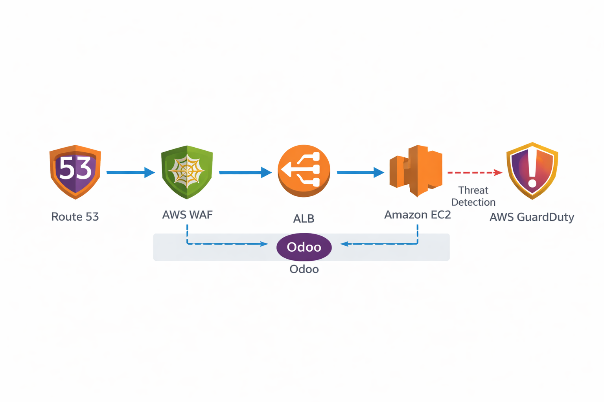

Arquitectura del Laboratorio

## Steps

El flujo de tráfico será: Usuario -> AWS WAF -> Application Load Balancer (ALB) -> Odoo (EC2).
Paralelamente, GuardDuty vigilará el comportamiento de la infraestructura para actuar en caso de compromiso.
Paso 1: Configuración del Web ACL (AWS WAF)

El WAF filtrará el tráfico antes de que llegue a Python/Odoo.

    Crear Web ACL: Ve a la consola de AWS WAF y crea una nueva "Web ACL" en la región donde esté tu Odoo.

    Asociación de Recursos: Selecciona tu Application Load Balancer (ALB) como el recurso asociado.

    Añadir Reglas Administradas (Managed Rule Groups): AWS ofrece reglas preconfiguradas que usan ML para actualizarse contra nuevas amenazas. Añade estas tres:

        Core Rule Set (CRS): Protege contra vulnerabilidades OWASP comunes.

        SQL Database: Específicamente diseñada para detectar intentos de inyección SQL en formularios y URLs de Odoo.

        Known Bad Inputs: Bloquea peticiones con carácteres extraños que suelen usar los exploits.

Paso 2: Implementación de Bot Control (Anti-Scraping)

Para evitar que la competencia use scripts para "robar" tus precios de los productos:

    Añadir Regla de Bot Control: Dentro de tu Web ACL, añade la regla gestionada AWS Managed Rules Bot Control.

    Configuración de Inspección:

        Selecciona el nivel de inspección (Common o Targeted).

        Esta regla utiliza firmas y comportamiento para diferenciar entre "Bots Buenos" (como GoogleBot) y "Bots Maliciosos" (scripts de Python/Scrapy sin identificar).

    Acción: Configura para que las peticiones clasificadas como "Verified Bot" pasen, pero las clasificadas como "Signal:Automated" sean bloqueadas con un error 403 Forbidden.

Paso 3: Configuración de Amazon GuardDuty (Detección de Intrusos)

GuardDuty no analiza el tráfico HTTP, sino los logs de flujo de red (VPC Flow Logs) y eventos de DNS para detectar comportamientos anómalos.

    Habilitar GuardDuty: Simplemente actívalo en la consola (es un solo clic).

    Escenario de Detección: GuardDuty detectará si tu instancia de Odoo empieza a comunicarse con servidores de C&C (Command & Control) o si empieza a realizar minería de criptomonedas (comportamiento típico tras un hackeo).

Paso 4: Automatización de la Respuesta (El "Botón de Pánico")

Aquí es donde la arquitectura se vuelve inteligente. Vamos a crear un flujo que aísle la instancia si GuardDuty encuentra algo grave.

    Crear Security Group de Cuarentena:

        Crea un Security Group llamado Odoo-Quarantine.

        Inbound Rules: Ninguna.

        Outbound Rules: Ninguna. (La instancia quedará totalmente sorda y muda).

    Crear una función AWS Lambda:

        Usa Python para crear una función que:

            Reciba el evento de GuardDuty.

            Extraiga el InstanceID afectado.

            Use la librería boto3 para cambiar el Security Group de la instancia por el de Odoo-Quarantine.

    Configurar EventBridge:

        Crea una regla en Amazon EventBridge que se dispare cuando GuardDuty genere un hallazgo (Finding) de tipo "Severity: High".

        Configura la Lambda anterior como el destino (Target) de este evento.

Paso 5: Prueba de Estrés y Validación

Para verificar que todo funciona, realizaremos dos pruebas:

    Test de Inyección SQL: Intenta loguearte en tu Odoo usando en el campo de usuario la cadena: ' OR 1=1 --. El WAF debería interceptar la petición y mostrarte un bloqueo antes de que Odoo llegue a procesar el error.

    Simulación de Scraping: Ejecuta un script de Python simple (usando la librería requests) que intente descargar la página de productos 100 veces en un bucle rápido. Verás cómo el WAF empieza a bloquear las peticiones tras detectar el patrón automatizado.

Beneficios de este enfoque:

    Defensa en Profundidad: No confías solo en el código de Odoo; tienes un guardia de seguridad (WAF) en la puerta.

    Respuesta Automática: Si un servidor es comprometido a las 3:00 AM, el sistema lo aísla solo, sin esperar a que un humano vea la alerta.

    Cumplimiento (Compliance): Cumples con estándares como PCI-DSS o GDPR al proteger datos sensibles contra ataques conocidos.

## Test
Test de Inyección SQL (Bypass de Login)

El objetivo es engañar a la base de datos para que nos deje entrar sin contraseña o extraiga datos que no debería.

    Acción: Ve a la URL de tu Odoo (ej. https://tu-odoo.com/web/login).

    Payload (Carga útil): En el campo de "Email/Usuario", escribe lo siguiente:
       ```
    admin' OR 1=1 --
   ```
    Lo que debería pasar: 1.  Si el WAF no está: Odoo intentará procesar la consulta y probablemente dará un error de "Login fallido" o, si el código fuera vulnerable, te loguearía.
    2.  Si el WAF está activo: Antes de que la petición llegue a Odoo, verás una página blanca con un texto similar a: "403 Forbidden - CloudFront/WAF".

    Verificación en AWS: Ve a la consola de WAF -> Sampled requests. Verás una petición bloqueada con la regla SQLi_BODY o SQLi_QUERYARGUMENTS.

Test de XSS (Inyección de Script)

Vamos a intentar que Odoo guarde un script malicioso que se ejecute en el navegador de otros usuarios (ej. para robar cookies de sesión).

    Acción: Ve al módulo de Contactos o CRM e intenta crear un nuevo registro.

    Payload: En el campo "Nombre", pega esto:
    ```
    <script>alert('Hacked');</script>
   ```
    Lo que debería pasar: Al darle a "Guardar", el navegador enviará un POST. El WAF detectará etiquetas <script> (Regla GenericLFI_BODY o CrossSiteScripting_BODY) y cortará la conexión inmediatamente.

5.3. Test de Scraping Progresivo (Bot Control)

Aquí simularemos a un competidor intentando descargar tu lista de precios usando un script de Python.

    Preparación: Crea un archivo llamado ataque.py en tu PC:

Python
   ```
import requests
import time

url = "https://tu-odoo.com/shop" # O cualquier URL pública de tu Odoo
for i in range(50):
    response = requests.get(url)
    print(f"Intento {i}: Status {response.status_code}")
    time.sleep(0.5) # Un bot rápido
   ```
    Ejecución: Corre el script.

    Resultado esperado: Las primeras peticiones podrían dar 200 OK, pero a medida que el WAF detecta que el User-Agent es de la librería python-requests y que la frecuencia es inhumana, el status cambiará a 403.

Simulación de Secuestro (GuardDuty)

Probar que la Lambda de Cuarentena funciona es lo más divertido, pero como no queremos hackear de verdad la instancia, usaremos los "Hallazgos de prueba".

    Generar Alerta: En la consola de GuardDuty, ve a Settings y haz clic en "Generate sample findings".

    Buscar el Hallazgo: Busca uno que se llame Backdoor:EC2/C&CActivity.B!DNS. Esto simula que tu Odoo se está comunicando con un servidor de control de hackers.

    Observar:

        EventBridge detectará este nuevo hallazgo.

        Disparará la Lambda.

        Ve a la consola de EC2 -> Selecciona tu instancia de Odoo -> Pestaña Security.

        Verificación: El Security Group original (que permitía el puerto 80/443) habrá desaparecido y ahora solo debe estar el grupo Odoo-Quarantine.

        Resultado: Si intentas entrar a Odoo desde tu navegador, la página no cargará. Has aislado el problema en segundos.

Código sugerido para la Lambda (Python 3.x)

Por si te animas a montarlo, este es el corazón del sistema de aislamiento:
Python
   ```
import boto3

def lambda_handler(event, context):
    ec2 = boto3.client('ec2')
    # Extraer el ID de la instancia del evento de GuardDuty
    instance_id = event['detail']['resource']['instanceDetails']['instanceId']
    # ID de tu Security Group de cuarentena (CÁMBIALO POR EL TUYO)
    quarantine_sg = 'sg-0123456789abcdef' 
    
    print(f"Alerta detectada para instancia {instance_id}. Aplicando cuarentena...")
    
    # Cambiar el Security Group de la instancia
    response = ec2.modify_instance_attribute(
        InstanceId=instance_id,
        Groups=[quarantine_sg]
    )
    
    return {
        'statusCode': 200,
        'body': f"Instancia {instance_id} aislada correctamente."
    }
   ```
