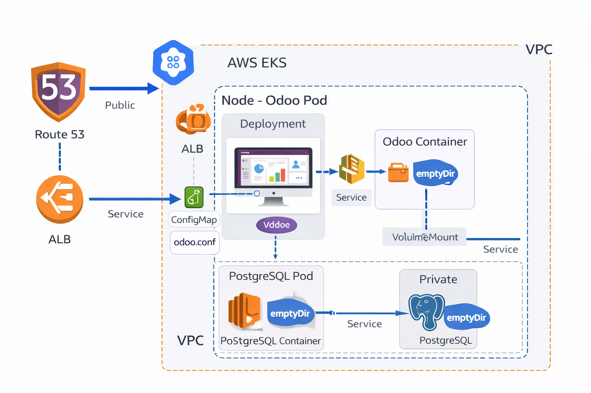

Esta es la configuración "LITE". Tu infraestructura de AWS se simplifica al máximo, pero recuerda: si el Pod se reinicia, los datos se borran.

Aquí tienes los fragmentos exactos que debes sustituir en tus archivos para que funcionen con almacenamiento efímero (emptyDir) y configuración inyectada (ConfigMap).

1. El nuevo archivo: 00-configmap.yaml

Como ya no hay un disco físico donde dejar el odoo.conf, lo creamos como un objeto de Kubernetes.

2. Cambios en 03-postgres-db.yaml

Sustituye la sección de volumes y volumeMounts por esta. Ya no necesitas el PVC.

3. Cambios en 04-odoo-deployment.yaml

Aquí montamos el almacenamiento temporal para los datos y el ConfigMap para la configuración.

4 - 05-odoo-service.yaml

Crea el Load Balancer en AWS para acceder por el puerto 80.