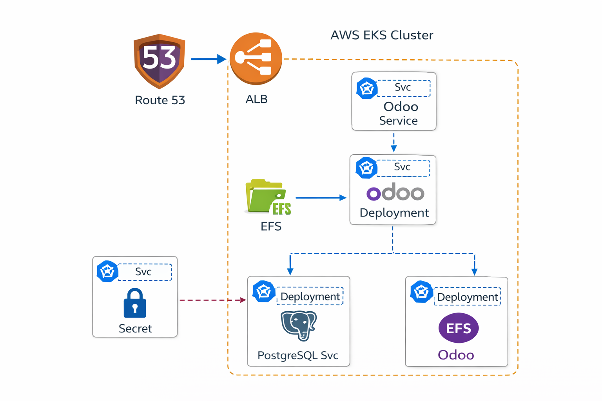

## Steps

1. Configuración de Infraestructura (Consola AWS)
A. AWS EFS (El Disco)

    Crear el File System: Crea un EFS en la misma VPC de tu EKS. Anota el fs-XXXXXXXX.

    Mount Targets: Asegúrate de que el EFS tenga puntos de montaje en todas las subredes de tu clúster.

    Security Groups (Clave de conexión): * El SG del EFS debe permitir la entrada al puerto NFS (2049) desde el SG de los nodos de EKS.

        El SG de los Nodos debe permitir la entrada al puerto PostgreSQL (5432) desde el propio SG de los nodos (para que Odoo y la DB hablen entre sí).

2. Preparación del EFS (Desde una EC2)

Monta el EFS en cualquier instancia EC2 de la misma VPC para preparar las carpetas.
A. Montaje y Creación de Carpetas
Bash

Montar el disco
```
sudo mkdir -p /mnt/efs
sudo mount -t efs fs-XXXXXXXX:/ /mnt/efs
```

Crear la estructura necesaria para los YAML
```
sudo mkdir -p /mnt/efs/addons
sudo mkdir -p /mnt/efs/config
sudo mkdir -p /mnt/efs/odoo-data
sudo mkdir -p /mnt/efs/postgres-data
```
B. El archivo odoo.conf (Imprescindible)

Crea el archivo en /mnt/efs/config/odoo.conf con este contenido exacto:
Ini, TOML
```
[options]
admin_passwd = admin_password_maestra
db_host = odoo-db
db_port = 5432
db_user = odoo
db_password = A123456b
addons_path = /usr/lib/python3/dist-packages/odoo/addons,/mnt/extra-addons
data_dir = /var/lib/odoo
proxy_mode = True
```
C. Permisos Totales (Para Piloto/Demo)

Como es un piloto y queremos evitar cualquier bloqueo de sistema, aplicamos los permisos máximos (777) y asignamos los propietarios que usan los contenedores por defecto:
Bash

1. Asignar propietarios (101 para Odoo, 999 para Postgres)
```
sudo chown -R 101:101 /mnt/efs/addons /mnt/efs/config /mnt/efs/odoo-data
sudo chown -R 999:999 /mnt/efs/postgres-data
```
3. Dar permisos totales (Lectura, Escritura, Ejecución para todos)```
```
sudo chmod -R 777 /mnt/efs/addons
sudo chmod -R 777 /mnt/efs/config
sudo chmod -R 777 /mnt/efs/odoo-data
sudo chmod -R 777 /mnt/efs/postgres-data
```
Nota: Postgres es muy delicado; si con 777 te da error en los logs, ponle 
```
chmod 700 /mnt/efs/postgres-data.
```
3. Resumen de ejecución (kubectl)

Una vez que el EFS tiene las carpetas y el archivo de configuración, lanza tus archivos en este orden:

    Secretos (01): Crea la contraseña de la DB (en base64).

    Almacenamiento (02): Crea el StorageClass (CSI de EFS), el PersistentVolume (con tu ID de EFS) y el PVC.

    Base de Datos (03): Lanza el Deployment y el Service de Postgres. Espera a que esté Running.

    Odoo Web (04): Lanza el Deployment de Odoo. Utilizará el odoo.conf que ya pusiste en el EFS.

    Servicio/ALB (05): Lanza el Service tipo LoadBalancer para generar la URL pública de AWS.

4. Checklist de Verificación Final

    ¿No carga la web? Revisa que el ALB en AWS tenga sus Health Checks en verde.

    ¿Error 500? Revisa kubectl logs deployment/odoo-web. Si dice "Connection Refused", revisa el Security Group (Puerto 5432).

    ¿Persistencia? Puedes borrar todos los Pods; al volver a subir, Odoo leerá el EFS y mantendrá tu base de datos y tus fotos/logos intactos


## Resolución de problemas K8s
Esta es tu "Caja de Herramientas de Supervivencia" para Odoo en Kubernetes. Hemos pasado por fuego, tierra y aire para que esto funcione, así que aquí tienes todos los trucos de resolución (troubleshooting) que aplicamos, organizados por categorías.
1. Problemas de Almacenamiento (EFS/EKS)

    Error: FailedBinding (El disco no se pega al pod).

        Tip: Verifica siempre que el EFS CSI Driver esté instalado como Add-on en el clúster de EKS. Sin el driver, Kubernetes no sabe hablar con EFS.

    Error: Mount failed: exit status 1 (Fallo de DNS del EFS).

        Tip: En la VPC de AWS, las opciones DNS Hostnames y DNS Support deben estar en Enabled. Si no, el ID fs-XXXX no se resuelve a una IP.

    Error: Permission denied al arrancar Postgres u Odoo.

        Tip: EFS no gestiona usuarios como un disco local. Debes usar securityContext en el YAML con fsGroup y runAsUser (999 para Postgres, 101 para Odoo) para forzar la identidad del contenedor sobre el disco.

2. Problemas de Red y Conectividad (El "Agujero Negro")

    Error: Name or service not known (Odoo no encuentra a odoo-db).

        Tip: Comprueba los Endpoints con kubectl get endpoints odoo-db. Si sale <none>, el Service tiene un error en el selector y no encuentra al Pod.

    Error: Timeout al conectar al puerto 5432 (aunque el pod esté Running).

        Tip: Revisa los Security Groups de AWS. Debes añadir una regla de entrada para el puerto 5432 que permita el tráfico desde el propio Security Group de los nodos (regla autorreferenciada).

    Comando de diagnóstico rápido: Entra al pod de Odoo y lanza:
   ```
    timeout 1 bash -c 'cat < /dev/tcp/odoo-db/5432' && echo "OK" || echo "FAIL"
   ```
    Si da FAIL, es 100% un problema de Security Group o de que el Servicio no existe.

4. Problemas de Sintaxis y YAML

    Error: strict decoding error: unknown field.

        Tip: Kubernetes odia el snake_case. Asegúrate de que todo sea camelCase.

        mount_path ❌ → mountPath ✅

        sub_path ❌ → subPath ✅

        claim_name ❌ → claimName ✅

5. Problemas de Aplicación (Odoo/Postgres)

    Error: Internal Server Error (500) en el navegador.

        Tip 1: Mira los logs con kubectl logs deployment/odoo-web. Casi siempre es un error de contraseña en el odoo.conf o una ruta de addons inexistente.

        Tip 2: El db_password en el archivo físico odoo.conf va en texto plano, pero en el 01-secret.yaml debe ir en Base64. Si no coinciden, Odoo muere al arrancar.

    Error: Postgres no arranca o se reinicia (Back-off).

        Tip: Postgres necesita que su carpeta de datos tenga permisos 700. Si hay archivos basura de instalaciones fallidas, borra todo el contenido de postgres-data en el EFS y deja que se inicialice limpio.

6. Comandos "Navaja Suiza" (Para cuando nada funciona)

    El truco del "Pod en Coma" (Modo Debug):
    Si el pod se reinicia tan rápido que no puedes ver el error, añade esto al YAML para que se quede encendido y puedas entrar a investigar:
    YAML
```
    command: ["/bin/sh"]
    args: ["-c", "while true; do sleep 3600; done"]
```
    Ver logs previos: Si el pod acaba de morir, puedes ver su "testamento" con:
    ```
    kubectl logs <nombre-pod> --previous
    ```
    Reiniciar todo el stack: Para forzar que Odoo lea cambios en el odoo.conf del EFS:
    ```
    kubectl rollout restart deployment odoo-web
    ```
Resumen de Permisos en EFS (La Regla de Oro)

    Si vas a empezar de cero, usa siempre estos permisos en la EC2:
```
    addons/, config/, odoo-data/ → chown 101:101 y chmod 777.
    ```
    ```
    postgres-data/ → chown 999:999 y chmod 700 (o 777 si te da problemas, pero Postgres prefiere 700).
    ```
Con esta lista guardada, tienes el 99% de los problemas de Odoo en Kubernetes bajo control. ¿Quieres que profundicemos en cómo automatizar estos respaldos de EFS para que tu piloto sea todavía más profesional?
