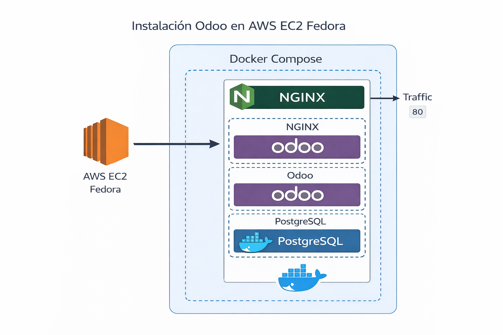

## AWS Academy + Odoo Academy

## LABs - Arquitecturas Modernas / Integraciones

<table>
<tr>
<td>

| # | Tema | # | Tema |
|---|------|---|------|
| 0 | Instalación | 8 | Backup |
| 1 | Desacoplo | 9 | IoT |
| 2 | Microservicios 2-3 Tier| 10 | AI |
| 3 | Alta Disponibilidad | 11 | CQRS |
| 4 | Serverless | 12 | Gen AI |
| 5 | Workflows | 13 | Multi Region |
| 6 | Analítica | 14 | Seguridad |
| 7 | Escalado | 15 | Kubernetes |

</td>
<td>



</td>
</tr>
</table>

## Odoo Installation

### EC2 AMI Linux 2023 - Docker
```
sudo dnf install git -y
sudo dnf install docker -y
sudo systemctl start docker
sudo systemctl enable docker
sudo usermod -aG docker $USER
sudo newgrp docker
```
```
sudo curl -s https://api.github.com/repos/docker/compose/releases/latest | grep browser_download_url | grep docker-compose-linux-x86_64 | cut -d '"' -f 4 | wget -qi -
sudo chmod +x docker-compose-linux-x86_64
sudo mv docker-compose-linux-x86_64 /usr/local/bin/docker-compose
docker-compose --version
```
```
mkdir -p ~/.docker/cli-plugins
curl -L https://github.com/docker/buildx/releases/download/v0.17.0/buildx-v0.17.0.linux-amd64 \
  -o ~/.docker/cli-plugins/docker-buildx
chmod +x ~/.docker/cli-plugins/docker-buildx
docker buildx version
```
## 2. Git Repository
```
git clone https://github.com/santos-pardos/Odoo-DockerCompose.git
```

## 3. EC2 EIP
```
Assing an EIP to EC2 Odoo
```
```
http://EIP:8069
```

## 4. NGINX - Reverse Proxy
```
sudo dnf install nginx -y
sudo systemctl start nginx
sudo systemctl enable nginx
```
```
sudo nano /etc/nginx/conf.d/odoo.conf
```
```
server {
    listen 80;

    # Ruta para /websocket → puerto 8072
    location /websocket/ {
        proxy_pass http://127.0.0.1:8072/;
        proxy_set_header Host $host;
        proxy_set_header X-Real-IP $remote_addr;
        proxy_set_header X-Forwarded-For $proxy_add_x_forwarded_for;
    }

    # Resto → puerto 8069
    location / {
        proxy_pass http://127.0.0.1:8069;
        proxy_set_header Host $host;
        proxy_set_header X-Real-IP $remote_addr;
        proxy_set_header X-Forwarded-For $proxy_add_x_forwarded_for;
    }
}
```
```
sudo systemctl restart nginx
```
## 5. Launch
```
cd Odoo-DockerCompose
sudo chown -R $USER:$USER addons config sessions
docker-compose up -d
```
```
docker-compose build --no-cache && docker compose up
```
## 6. Stop
```
docker-compose down
```

## 7. Tips
```
docker logs <container_name>
The actual log will also be at /etc/odoo/odoo.log inside the container
```
## 8. DdBeaver
```
docker run -d --network odoo-docker_default --name cloudbeaver --restart unless-stopped -p 8978:8978 -v /opt/cloudbeaver/workspace dbeaver/cloudbeaver:latest
```

## 9. PSQL
```
docker-compose ps
docker-compose logs db
docker-compose exec db ss -lnt
docker-compose exec db psql -U odoo -d postgres
docker-compose exec db bash
docker exec -it ID-Postgress /bin/bash
psql -U odoo -d postgres
\du               usuarios
\l                bases de datos
\dt               tables
\dt *.*
\c nombre_bd_odoo cambia de bbdd
\d nombre-tabla   estructura tabla
\dt res_*
\dt ir_*
\dt sale_*
```
##  Links
```
https://medium.com/@rajeshpachaikani/deploying-odoo-in-minutes-with-docker-compose-61a4d07b8877
```

##  Install withoug docker-compose
```
docker run -d -e POSTGRES_USER=odoo -e POSTGRES_PASSWORD=odoo -e POSTGRES_DB=postgres --name db postgres:latest
```
```
docker run -t -p 8069:8069 --name odoo --link db:db -d odoo:latest
```
## Install with 3 containers (Odoo - Postgres - Nginx)
```
docker compose -f docker-compose-3-container.yaml up -d
```


